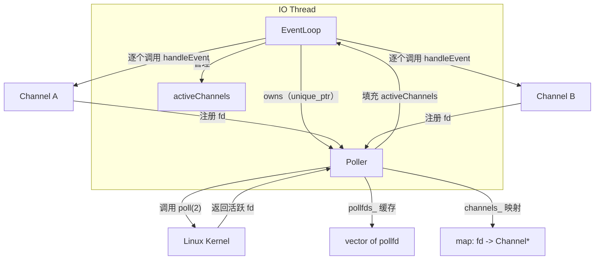
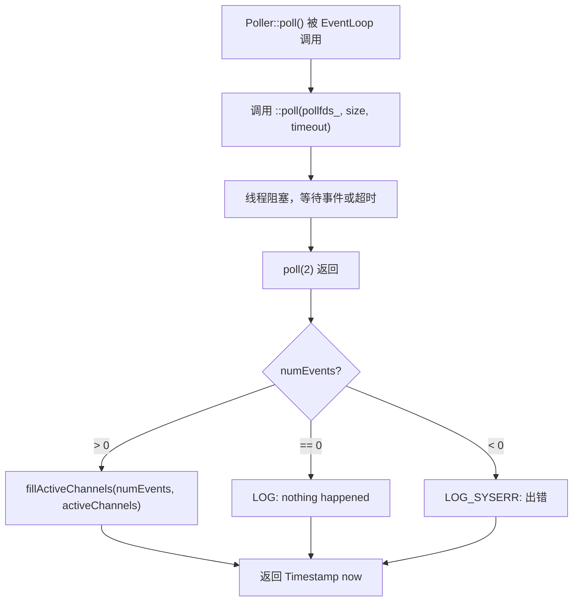
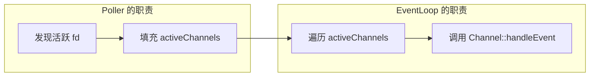

# Muduo Poller 类理解说明

## 原话

> Poller class 是 IO multiplexing 的封装。它现在是个具体类，而在 muduo 中是个抽象基类，因为 muduo 同时支持 poll(2) 和 epoll(4) 两种 IO multiplexing 机制。Poller 是 EventLoop 的间接成员，只供其 owner EventLoop 在 IO 线程调用，因此无须加锁。其生命期与 EventLoop 相等。Poller 并不拥有 Channel，Channel 在析构之前必须自己 unregister（EventLoop::removeChannel()），避免空悬指针。

---

## 1. Poller 是什么

**一句话**：Poller 是对操作系统 IO 多路复用（IO multiplexing）接口的封装。

### 什么是 IO multiplexing

在网络编程中，一个服务器往往要同时监听几十甚至上万个文件描述符（socket）。如果为每个 fd 开一个线程来等待数据，资源开销太大。操作系统提供了一种机制——**IO 多路复用**——让一个线程可以同时监视多个 fd，"谁有数据来了就告诉我"。

Linux 上常见的 IO 多路复用系统调用有：

| 系统调用 | 特点 |
|---------|------|
| `select(2)` | 最古老，fd 数目有上限（通常 1024） |
| `poll(2)` | 没有 fd 数量限制，但每次调用都要把整个 fd 数组从用户态拷贝到内核态 |
| `epoll(4)` | Linux 特有，内核维护 fd 集合，效率最高 |

Poller 就是把 `poll(2)`（或 `epoll(4)`）的细节包起来，让 `EventLoop` 不用直接跟系统调用打交道。

### 在教学版和正式版中的区别

- **教学版（reactor/s01）**：Poller 是一个**具体类**，只使用 `poll(2)`。
- **正式 muduo**：Poller 是一个**抽象基类**，有两个子类 `PollPoller` 和 `EPollPoller`，分别封装 `poll(2)` 和 `epoll(4)`。

这体现了一个设计演进思路：先用简单实现把架构搭好，再通过多态替换更高效的实现。

---

## 2. 架构关系图



### 所有权关系要点

| 关系 | 说明 |
|------|------|
| EventLoop **拥有** Poller | Poller 是 EventLoop 的间接成员（通过指针持有），生命期与 EventLoop 相等 |
| Poller **不拥有** Channel | Poller 只持有 `Channel*` 裸指针，不负责 Channel 的生命期 |
| Channel 必须自己 unregister | Channel 析构前必须调用 `EventLoop::removeChannel()` 把自己从 Poller 中移除，否则 Poller 中会残留空悬指针 |

---

## 3. 头文件设计：前向声明的技巧

原文提到：

> Poller.h 并没有 `#include <poll.h>`，而是自己前向声明了 `struct pollfd`，这不妨碍我们定义 `vector<struct pollfd>` 成员。

### 为什么可以这么做

```cpp
// Poller.h 中
struct pollfd;  // 前向声明，不需要 #include <poll.h>

class Poller {
    // ...
    std::vector<struct pollfd> pollfds_;  // 合法！
};
```

这看起来违反直觉——"不知道 `pollfd` 的完整定义，怎么能放进 `vector` 里？"

关键在于：**头文件只是声明，不是实现**。编译器在处理头文件时，只需要知道 `Poller` 类里有一个 `vector<struct pollfd>` 成员，但不需要立刻知道 `pollfd` 有多大。真正需要完整定义的时刻是在 `.cc` 文件中使用 `pollfds_` 的元素时——而 `Poller.cc` 里会 `#include <poll.h>`。

### 好处

- **减少头文件依赖**：包含 `Poller.h` 的文件不需要间接引入 `<poll.h>`，加快编译速度。
- **降低耦合**：如果将来把底层从 `poll` 换成 `epoll`，只需要改 `.cc` 文件，不需要改 `.h` 文件（正式 muduo 就是这么做的）。

> **注意**：这个技巧能成立，是因为 `std::vector` 内部只存一个指向堆内存的指针，不需要在声明时知道元素的完整大小。如果是 `struct pollfd pollfds_[100];`（数组成员），就必须 `#include <poll.h>`。

---

## 4. 数据成员详解

```cpp
// Poller.h
private:
    EventLoop* ownerLoop_;                        // 所属的 EventLoop
    typedef std::vector<struct pollfd> PollFdList;
    PollFdList pollfds_;                          // 缓存的 pollfd 数组

    typedef std::map<int, Channel*> ChannelMap;
    ChannelMap channels_;                         // fd -> Channel* 的映射
```

### 逐个解读

#### `ownerLoop_`

指向拥有此 Poller 的 EventLoop。用途：
- 通过 `ownerLoop_->assertInLoopThread()` 检查当前调用是否在正确的 IO 线程上。

#### `pollfds_`（`vector<struct pollfd>`）

这是传给 `poll(2)` 系统调用的 fd 数组。

```c
// poll(2) 的签名
int poll(struct pollfd *fds, nfds_t nfds, int timeout);

// struct pollfd 的定义（来自 <poll.h>）
struct pollfd {
    int   fd;       // 文件描述符
    short events;   // 关心的事件（POLLIN / POLLOUT 等）
    short revents;  // 实际发生的事件（由内核填写）
};
```

Poller **不会每次调用 `poll(2)` 前临时构造这个数组**，而是把它缓存在 `pollfds_` 中。每次 Channel 注册或更新时，直接修改 `pollfds_` 中对应的元素。这样避免了频繁的内存分配。

#### `channels_`（`map<int, Channel*>`）

从文件描述符 `fd` 到 `Channel*` 的映射。

当 `poll(2)` 返回后告诉我们"fd=5 有事件了"，我们需要知道 fd=5 对应哪个 Channel，才能调用正确的回调函数。这个 map 就是用来做这个查找的。

```
pollfds_:  [{fd=3, events=POLLIN}, {fd=5, events=POLLIN|POLLOUT}, ...]
channels_: {3 -> ChannelA*, 5 -> ChannelB*, ...}
```

---

## 5. 构造函数和析构函数

```cpp
// Poller.cc
Poller::Poller(EventLoop* loop)
  : ownerLoop_(loop)
{
}

Poller::~Poller()
{
}
```

构造和析构都很简单，因为：

- `ownerLoop_` 只是一个裸指针，不管生命期。
- `pollfds_`（`vector`）和 `channels_`（`map`）都是标准库容器，析构时会自动清理自己的内存。
- Poller **不拥有** Channel 对象，所以析构时不需要 `delete` 任何 Channel。

这体现了 C++ 的 RAII 理念：让标准库容器管理内存，类本身不需要写复杂的资源释放逻辑。

---

## 6. `poll()` 核心函数

```cpp
Timestamp Poller::poll(int timeoutMs, ChannelList* activeChannels)
{
    // XXX pollfds_ shouldn't change
    int numEvents = ::poll(&*pollfds_.begin(), pollfds_.size(), timeoutMs);
    Timestamp now(Timestamp::now());
    if (numEvents > 0) {
        LOG_TRACE << numEvents << " events happended";
        fillActiveChannels(numEvents, activeChannels);
    } else if (numEvents == 0) {
        LOG_TRACE << " nothing happended";
    } else {
        LOG_SYSERR << "Poller::poll()";
    }
    return now;
}
```

### 逐行解读

#### `::poll(&*pollfds_.begin(), pollfds_.size(), timeoutMs)`

这一行做了三件事：

1. **`::poll(...)`**：调用的是 POSIX 的 `poll(2)` 系统调用（前面的 `::` 表示全局命名空间，避免跟 `Poller::poll` 本身混淆）。

2. **`&*pollfds_.begin()`**：获取 `pollfds_` 数组首元素的地址。拆解这个表达式：
   ```
   pollfds_.begin()   → 返回迭代器（指向第一个元素）
   *pollfds_.begin()  → 解引用迭代器，得到第一个 struct pollfd
   &*pollfds_.begin() → 取它的地址，得到 struct pollfd*
   ```
   

   C++ 标准保证 `std::vector` 的元素在内存中是连续排列的，所以这个指针可以直接当 C 数组传给 `poll(2)`。

   > 在 C++11 中可以更简洁地写成 `pollfds_.data()`，效果完全一样。

3. **`pollfds_.size()`**：告诉 `poll(2)` 一共有多少个 fd 需要监视。

#### 返回值处理

| `numEvents` 的值 | 含义 |
|------------------|------|
| `> 0` | 有活跃的 fd，调用 `fillActiveChannels` 填充结果 |
| `== 0` | 超时，没有任何事件发生 |
| `< 0` | 出错（比如被信号中断） |

#### 返回时刻 `now`

`poll()` 返回的 `Timestamp now` 记录的是 `poll(2)` 系统调用返回的那一刻。这个时间戳会传给 `Channel::handleEvent()`，让回调函数知道事件发生的大概时间。

### 流程图



---

## 7. `fillActiveChannels()` 函数

```cpp
void Poller::fillActiveChannels(int numEvents,
                                ChannelList* activeChannels) const
{
    for (PollFdList::const_iterator pfd = pollfds_.begin();
         pfd != pollfds_.end() && numEvents > 0; ++pfd)
    {
        if (pfd->revents > 0)
        {
            --numEvents;
            ChannelMap::const_iterator ch = channels_.find(pfd->fd);
            assert(ch != channels_.end());
            Channel* channel = ch->second;
            assert(channel->fd() == pfd->fd);
            channel->set_revents(pfd->revents);
            activeChannels->push_back(channel);
        }
    }
}
```

### 逐步解读

1. **遍历 `pollfds_`**：逐个检查每个 `pollfd`，看 `revents`（内核填写的实际发生事件）是否大于 0。

2. **`--numEvents` 提前退出优化**：
   - `poll(2)` 的返回值 `numEvents` 告诉我们有多少个 fd 发生了事件。
   - 每找到一个活跃的 fd，就把 `numEvents` 减 1。
   - 当 `numEvents` 减到 0 时，说明所有活跃的 fd 都已经找到了，循环条件 `numEvents > 0` 不再满足，提前退出。
   - 这样如果 10000 个 fd 中只有 3 个活跃，找到第 3 个就立刻停止，不用遍历剩下的 9997 个。

3. **通过 `channels_` 查找对应的 Channel**：
   ```
   pfd->fd = 5          →  在 channels_ 中查找 key=5
                         →  得到 Channel* channel
   ```

4. **`channel->set_revents(pfd->revents)`**：把内核返回的事件保存到 Channel 中，供后续 `Channel::handleEvent()` 使用。

5. **`activeChannels->push_back(channel)`**：把活跃的 Channel 放入输出列表，返回给 EventLoop。

### 复杂度

**O(N)**，其中 N 是 `pollfds_` 的长度。最坏情况下需要遍历所有 fd。但由于 `--numEvents` 优化，平均情况下会比 O(N) 快。

### 为什么不能边遍历边 dispatch

原文强调：

> 不能一边遍历 `pollfds_`，一边调用 `Channel::handleEvent()`。

原因有两个：

**原因一：安全性**

`Channel::handleEvent()` 的回调函数可能会添加或删除 Channel，这意味着会调用 `updateChannel()` 或 `removeChannel()` 来修改 `pollfds_`。如果我们正在用 `for` 循环遍历 `pollfds_`，它的大小突然变了——迭代器可能失效，轻则结果错误，重则程序崩溃。

```
遍历 pollfds_ 中...
    → 处理 fd=3 的事件
    → 回调函数关闭了 fd=5 → removeChannel → pollfds_ 大小改变！
    → 继续遍历 → 迭代器已失效 → 未定义行为！
```

**原因二：职责分离**

Poller 的职责是 **IO multiplexing**（发现哪些 fd 有事件），不是 **事件分发**（dispatching，调用回调函数）。把这两个职责分开，好处是：

- 将来可以把 `Poller` 从 `poll` 换成 `epoll`，只需要改 IO multiplexing 部分，dispatch 逻辑不用动。
- 代码更清晰，每个类各做一件事。



---

## 8. `updateChannel()` 函数

```cpp
void Poller::updateChannel(Channel* channel)
{
    assertInLoopThread();
    LOG_TRACE << "fd = " << channel->fd() << " events = " << channel->events();
    if (channel->index() < 0) {
        // 新 Channel，添加到 pollfds_
        assert(channels_.find(channel->fd()) == channels_.end());
        struct pollfd pfd;
        pfd.fd = channel->fd();
        pfd.events = static_cast<short>(channel->events());
        pfd.revents = 0;
        pollfds_.push_back(pfd);
        int idx = static_cast<int>(pollfds_.size()) - 1;
        channel->set_index(idx);
        channels_[pfd.fd] = channel;
    } else {
        // 已有 Channel，更新 pollfds_ 中对应的条目
        assert(channels_.find(channel->fd()) != channels_.end());
        assert(channels_[channel->fd()] == channel);
        int idx = channel->index();
        assert(0 <= idx && idx < static_cast<int>(pollfds_.size()));
        struct pollfd& pfd = pollfds_[idx];
        assert(pfd.fd == channel->fd() || pfd.fd == -1);
        pfd.events = static_cast<short>(channel->events());
        pfd.revents = 0;
        if (channel->isNoneEvent()) {
            pfd.fd = -1;  // 忽略此 pollfd
        }
    }
}
```

### 两种分支

#### 分支一：新 Channel（`channel->index() < 0`）

Channel 的 `index` 初始值为 -1，表示还没有注册到 Poller 中。

操作步骤：

1. **assert 确认这个 fd 确实不在 `channels_` 中**（防止重复添加）。
2. **构造一个 `struct pollfd`**，填入 fd 和关心的事件。
3. **`push_back` 到 `pollfds_` 末尾**。
4. **记录 index**：把新元素在 `pollfds_` 中的下标告诉 Channel（`channel->set_index(idx)`）。
5. **加入 `channels_` 映射**。

复杂度：`push_back` 是 O(1) 均摊，`channels_[pfd.fd]` 是 `std::map` 的插入，O(log N)。所以总体 **O(log N)**。

#### 分支二：已有 Channel（`channel->index() >= 0`）

Channel 之前已经注册过了，现在只是要更新它关心的事件。

操作步骤：

1. **通过 `channel->index()` 直接定位**到 `pollfds_` 中的位置——这是 O(1) 的随机访问，不需要遍历。
2. **更新 `pfd.events`**。
3. **如果 Channel 不再关心任何事件**（`isNoneEvent()`），把 `pfd.fd` 设为 -1（后面详解）。

复杂度：**O(1)**，因为 Channel 记住了自己的 index。

### Channel 记住 index 的设计

这是一个巧妙的设计：

```
pollfds_: [{fd=3}, {fd=5}, {fd=7}]
              ↑        ↑        ↑
           index=0   index=1   index=2
              ↓        ↓        ↓
           ChannelA  ChannelB  ChannelC
           (记住 index=0) (记住 index=1) (记住 index=2)
```

每个 Channel 内部保存自己对应的 `pollfds_` 下标。这样更新时不需要在数组里搜索，直接 `pollfds_[idx]` 定位，做到了 O(1) 更新。

### assert 的密集使用

`updateChannel()` 中大量使用了 `assert` 来检查 **invariant**（不变量）：

- `channels_` 和 `pollfds_` 的一致性（fd 必须对应正确的 Channel）
- index 在合法范围内
- 新增时 fd 不能已存在、更新时 fd 必须已存在

这些 assert 在 Debug 模式下帮助尽早发现 bug。在 Release 模式下会被编译器移除，不影响性能。

---

## 9. fd = -1 屏蔽技巧

### 问题：如何让 `poll(2)` 忽略某个 fd

当一个 Channel 暂时不关心任何事件时，我们不想把它从 `pollfds_` 数组中物理删除（删除中间元素要移动后续所有元素，代价太大），而是希望让 `poll(2)` 跳过它。

### 做法：把 `pfd.fd` 设为 -1

```cpp
if (channel->isNoneEvent()) {
    pfd.fd = -1;  // poll(2) 会忽略 fd 为负数的条目
}
```

`poll(2)` 的行为规定：如果 `pollfd.fd` 是负数，这一项会被忽略（`revents` 会被置为 0）。

### 为什么不能把 `pfd.events` 设为 0

直觉上，把关心的事件设为空（`events = 0`）似乎也能达到"什么都不监听"的效果。但这行不通：

> 设置 `events = 0` 无法屏蔽 `POLLERR` 事件。

`POLLERR`（错误事件）是不可屏蔽的——即使你没有注册它，只要 fd 上发生了错误，`poll(2)` 仍然会在 `revents` 中设置 `POLLERR`。所以 `events = 0` 并不能真正让 `poll(2)` 完全忽略这个 fd。

而 `fd = -1` 是让 `poll(2)` 从根本上跳过这一项，连检查都不做。

### 改进做法：`fd = -(channel->fd()) - 1`

原文提到一种更好的做法：

```cpp
pfd.fd = -(channel->fd()) - 1;  // 即 -(fd + 1)
```

#### 为什么要 "减一"

因为 fd 的值可能是 0。

- 如果直接取相反数：`-(0) = 0`，0 不是负数，`poll(2)` 不会忽略它。
- 加上减一：`-(0) - 1 = -1`，是负数，会被忽略。

对于其他 fd 值：
- `fd = 3` → `-(3) - 1 = -4`（负数，会被忽略）
- `fd = 0` → `-(0) - 1 = -1`（负数，会被忽略）

#### 额外好处：可以反推原始 fd

存储 `-(fd + 1)` 而不是统一的 `-1`，可以从负数**还原出原始的 fd**：

```
原始 fd = -(pfd.fd) - 1
```

验证：
- `pfd.fd = -4` → `-(−4) − 1 = 4 − 1 = 3` → 原始 fd = 3
- `pfd.fd = -1` → `−(−1) − 1 = 1 − 1 = 0` → 原始 fd = 0

这样在 `assert` 或调试时，即使 fd 被"屏蔽"了，仍然能知道它原来对应的是哪个文件描述符，便于进一步检查 invariant（比如确认这个位置确实属于预期的 Channel）。

---

## 10. 生命期与线程安全

### Poller 的生命期

- Poller 由 EventLoop 创建和销毁，生命期与 EventLoop **完全一致**。
- EventLoop 的生命期通常与其所属线程一样长。

所以 Poller 不会在 EventLoop 还活着的时候就被销毁，也不会在 EventLoop 销毁后还残留。

### Poller 不拥有 Channel

Poller 的 `channels_` 成员存储的是 `Channel*`（裸指针），Poller **不负责**这些 Channel 的生命期管理。

这意味着：

```
Channel 创建 → 调用 EventLoop::updateChannel() → Poller 记住 Channel*
Channel 要销毁了 → 必须先调用 EventLoop::removeChannel() → Poller 删除 Channel*
Channel 销毁

如果 Channel 销毁时没有先 unregister：
→ Poller 中仍然保存着一个 Channel*
→ 这个指针指向已释放的内存
→ 空悬指针！未定义行为！
```

这是一个"谁创建谁负责清理"的设计约定。

### 线程安全

Poller 的所有公开接口（`poll()`、`updateChannel()`）都**只在 IO 线程中调用**：

```cpp
void Poller::updateChannel(Channel* channel)
{
    assertInLoopThread();  // 第一行就检查：当前必须在 IO 线程
    // ...
}
```

因为只有一个线程会访问 Poller 的数据结构，所以不存在竞争条件，**不需要加锁**。这是 muduo "one loop per thread" 设计哲学的直接体现。

---

## 11. 常见疑问小结

### Q1：`&*pollfds_.begin()` 为什么不直接写 `&pollfds_[0]`？

两种写法效果相同。`&*pollfds_.begin()` 是一种更通用的写法，理论上对空容器更安全（尽管在这里 `poll()` 被调用时 `pollfds_` 不应为空）。C++11 推荐用 `pollfds_.data()`，最简洁也最安全。

### Q2：为什么新增 Channel 的复杂度是 O(log N) 而不是 O(1)？

- `pollfds_.push_back()` 是 O(1) 均摊。
- 但 `channels_[pfd.fd] = channel` 是 `std::map` 的插入操作，`std::map` 底层是红黑树，插入复杂度为 O(log N)。
- 所以总复杂度取决于较慢的那个操作：**O(log N)**。

### Q3：`removeChannel()` 为什么教学版还没实现？

教学版（reactor/s01）是一个逐步迭代的版本。在最初几节中，Channel 一旦注册就不会被移除（只有通过设 `fd = -1` 来暂停），所以暂时不需要 `removeChannel()`。后续章节会添加这个函数。

### Q4：Poller 如果只在一个线程用，为什么还要 `assertInLoopThread()`？

这是 **防御性编程**。虽然设计上 Poller 只在 IO 线程调用，但万一有人不小心在其他线程调用了（比如从回调中直接修改 Channel），这个 assert 能在 Debug 模式下立即报错，帮助快速定位 bug。比起"运行一段时间后出现随机崩溃"，assert 失败的错误信息要有用得多。

### Q5：为什么 Poller 不直接用 `epoll` 而用 `poll`？

教学版从 `poll` 开始是因为 `poll` 的接口更简单——把一个 `pollfd` 数组传进去就行。`epoll` 虽然性能更好，但 API 更复杂（需要 `epoll_create`、`epoll_ctl`、`epoll_wait` 三步操作）。先用简单的实现把 Reactor 架构搭好，再替换高效实现，是一种务实的迭代开发策略。

---

## 12. 快速参考

| 项目 | 说明 |
|------|------|
| **类名** | `Poller` |
| **职责** | IO multiplexing 的封装（调用 `poll(2)`） |
| **所属** | EventLoop 的间接成员 |
| **线程安全** | 无须加锁，只在 IO 线程调用 |
| **生命期** | 与 EventLoop 相等 |
| **是否拥有 Channel** | 否，Channel 必须自己 unregister |
| **核心接口** | `poll()`、`updateChannel()` |
| **数据成员** | `pollfds_`（pollfd 缓存）、`channels_`（fd→Channel* 映射） |
| **添加 Channel 复杂度** | O(log N) |
| **更新 Channel 复杂度** | O(1) |
| **`poll()` 返回值** | 活跃事件数（`> 0` / `== 0` / `< 0`） |
| **fd 屏蔽方式** | `pfd.fd = -1`（简单版）或 `pfd.fd = -(fd+1)`（可还原版） |
