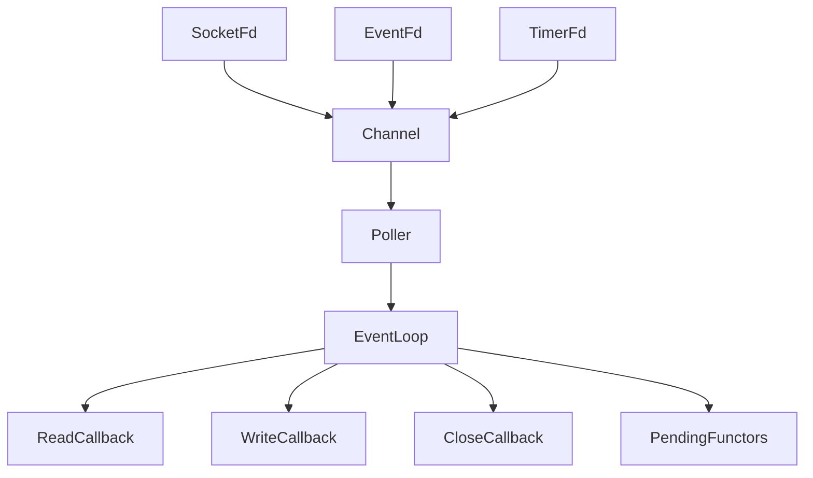
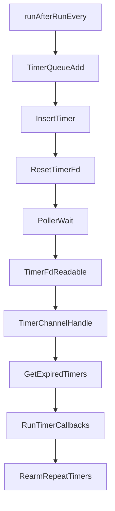
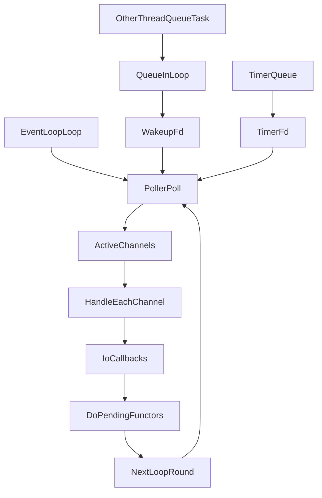

# Muduo EventLoop 学习指南

## 1. EventLoop 是什么

如果你刚接触网络编程，可以先把 `EventLoop` 理解成一句话：

**它是一个不断等待事件、分发事件、执行回调的循环器。**

在 `muduo` 里，`EventLoop` 是 Reactor 模型的核心对象。它自己一般不直接做具体业务，而是负责：

- 等待 I/O 事件到来
- 把事件交给对应的 `Channel`
- 在合适的时候执行回调函数
- 管理定时任务
- 处理其他线程投递过来的任务

`muduo` 源码里有一句非常关键的话：

```cpp
/// Reactor, at most one per thread.
```

意思是：

- `EventLoop` 本质上就是 Reactor
- 一个线程里最多放一个 `EventLoop`

这句话几乎决定了 `muduo` 的整体线程模型。

## 2. 为什么需要 EventLoop

假设你写一个服务器，要同时处理很多连接。

最朴素的想法是：

- 来一个连接，开一个线程
- 每个线程阻塞等待自己的 socket

但这样会有明显问题：

- 线程太多，切换成本高
- 内存占用大
- 连接数一多，管理困难

更高效的方法是：

- 用一个线程管理很多 fd
- 谁可读、谁可写，再处理谁
- 没有事件时就阻塞等待，不空转浪费 CPU

这就是 I/O 多路复用 + Reactor 的思路。

而 `EventLoop`，就是把这套机制组织起来的“调度中心”。

## 3. 先建立整体图景

在学习 `muduo` 时，你可以先记住这条主线：

`fd -> Channel -> Poller -> EventLoop -> 回调函数`

它们的职责分别是：

- `fd`：文件描述符，比如 socket、eventfd、timerfd
- `Channel`：对 fd 的封装，记录“关心什么事件”和“事件来了执行什么回调”
- `Poller`：I/O 复用器的抽象层，底层通常是 `epoll`
- `EventLoop`：驱动整个事件循环

P.S.
- socket 不是“文件描述符本身”，但 socket 在用户态通常就是通过一个文件描述符 fd 来表示和操作的。
- socket：内核里的一个“网络通信对象”
fd：进程里用来引用这个对象的“整数句柄”
例如：
```
int fd = socket(AF_INET, SOCK_STREAM, 0);
```
这里：
- socket(...) 创建了一个网络 socket
- 返回的 fd 是一个整数，比如 3
- 之后你用这个 fd 去 bind、listen、accept、read、write、send、recv
### socket 的作用是什么
它的作用是：让程序和网络通信。

具体可以分两类看：
服务端：
- 创建监听 socket
- 绑定端口
- 接收客户端连接
客户端/连接端：
- 连接对方
- 发送数据
- 接收数据
所以 socket 可以理解成“网络世界里的通信端点”。

### 文件描述符是什么
文件描述符 fd 本质上是一个小整数，是进程打开某个内核对象后的“编号”。

Linux 里很多东西都用 fd 操作，不只是普通文件，还包括：
- 普通文件
- socket
- pipe
- eventfd
- timerfd
- epoll fd
  
这就是“万物皆文件”思想的一部分。

如果一台服务器上的某个监听 socket 绑定了：

- 本地 IP = aaa
- 本地端口 = bbb
那么它会接收：

- 目标 IP 是 aaa
- 目标端口是 bbb
- 协议也匹配（比如这个 socket 是 TCP 监听 socket）
的连接请求。

这里强调两点：

1. 是“监听 socket”在接收连接请求，负责传输数据的socket不负责这个事情。
2. 监听 socket 主要处理的是“连接请求”而不是所有 TCP 包：客户端发起连接时的 SYN / 建连流程。

监听 socket 接收请求后，通过 accept() 生成新的连接 socket。

后续真正传输业务数据的，不再是监听 socket，而是通过 accept() 生成的socket。


可以看下面这张图：



你会发现，`muduo` 的设计非常统一：

- 网络读写事件，走这条链
- 跨线程唤醒事件，也走这条链
- 定时器事件，还是走这条链

这就是它优雅的地方：**把不同来源的事件统一纳入同一个事件循环处理。**

## 4. EventLoop 的核心成员(没看)

从 `EventLoop.h` 可以看到几个非常关键的成员：

- `poller_`
- `timerQueue_`
- `wakeupFd_`
- `wakeupChannel_`
- `activeChannels_`
- `pendingFunctors_`
- `threadId_`

下面分别解释。

### 4.1 `poller_`

`poller_` 是底层 I/O 复用器的抽象对象。

在 Linux 下，通常最终会落到 `epoll`。  
`EventLoop` 不直接写 `epoll_wait()`，而是通过 `Poller` 抽象解耦。

这样做的好处是：

- `EventLoop` 只关心“拿到活跃事件”
- 不关心底层到底是 `poll` 还是 `epoll`

### 4.2 `activeChannels_`

这是一轮 `poll` 返回之后的“活跃 Channel 列表”。

意思是：

- 这一轮有哪些 fd 发生了事件
- 这些事件对应哪些 `Channel`

`EventLoop` 接下来就遍历它，逐个调用 `handleEvent()`。

### 4.3 `timerQueue_`

这是定时器管理器。

它负责：

- 保存未来要执行的定时任务
- 在到期时通知 `EventLoop`
- 支持一次性定时器和重复定时器

所以 `runAt()`、`runAfter()`、`runEvery()` 最终都会委托给它。

### 4.4 `wakeupFd_` 和 `wakeupChannel_`

这是 `muduo` 里非常经典的一套设计。

作用只有一个：

**当别的线程想让当前 EventLoop 赶紧醒来处理事情时，用它把阻塞中的 loop 唤醒。**

其中：

- `wakeupFd_` 一般是 `eventfd`
- `wakeupChannel_` 负责监听这个 fd 的可读事件

### 4.5 `pendingFunctors_`

这是一个任务队列，里面放的是待执行的函数对象。

典型场景：

- 其他线程不方便直接操作这个 loop
- 就把任务塞进 `pendingFunctors_`
- 再唤醒 loop
- loop 在线程安全的位置统一执行这些任务

### 4.6 `threadId_`

`EventLoop` 会记录“自己属于哪个线程”。

这样它就能做很多安全检查，例如：

- 某些操作必须在所属线程执行
- 如果不是本线程调用，就报错或转为异步投递

这正是 `one loop per thread` 落地的基础。

## 5. EventLoop 的主循环到底在做什么

`EventLoop::loop()` 是整个类最重要的函数。

它可以概括成 4 步：

1. 阻塞等待事件
2. 拿到活跃 Channel
3. 逐个处理 Channel 事件
4. 执行本轮待执行任务

核心代码逻辑非常清晰：

```cpp
while (!quit_)
{
  activeChannels_.clear();
  pollReturnTime_ = poller_->poll(kPollTimeMs, &activeChannels_);

  eventHandling_ = true;
  for (Channel* channel : activeChannels_)
  {
    currentActiveChannel_ = channel;
    currentActiveChannel_->handleEvent(pollReturnTime_);
  }
  currentActiveChannel_ = NULL;
  eventHandling_ = false;

  doPendingFunctors();
}
```

你可以把它理解成：

- `poller_->poll(...)`：问内核“谁有事了？”
- `activeChannels_`：内核回答“这几个 fd 有事”
- `channel->handleEvent(...)`：按 fd 找到对应逻辑去执行
- `doPendingFunctors()`：顺便把别人投递来的任务处理一下

## 6. 为什么 `Channel` 很重要

很多初学者第一次看 `muduo` 时，容易把注意力都放在 `epoll` 上。

其实 `Channel` 一样关键。

`Channel` 可以理解成：

**fd 的 C++ 对象化封装。**

它不拥有 fd，但它知道：（channel知道当某个fd来请求后，应该执行什么函数，什么操作）

- 这个 fd 是多少
- 关心读事件还是写事件
- 实际返回了什么事件
- 读/写/关闭/错误时该执行什么回调

例如它有这些接口：

- `setReadCallback()`
- `setWriteCallback()`
- `enableReading()`
- `enableWriting()`
- `disableAll()`

这说明 `Channel` 干的是“事件描述”和“回调管理”的活。

所以：

- `Poller` 管“监听”
- `Channel` 管“这个 fd 要怎么处理”
- `EventLoop` 管“驱动整个流程”

## 7. Poller 在这里扮演什么角色

`Poller` 是 I/O 复用模块的抽象基类。

它主要提供 3 个核心动作：（同时监听多个fd，看哪个fd来请求了，然后将该fd对应的channel（fd应该做什么操作）返回）

- `poll()`
- `updateChannel()`
- `removeChannel()`

意思分别是：

- `poll()`：等待事件发生，并返回活跃 Channel
- `updateChannel()`：告诉底层“这个 fd 现在关心哪些事件”
- `removeChannel()`：把这个 fd 从监听集合里移除

在 Linux 上，具体实现一般是 `EPollPoller`。

因此关系可以理解成：

- `EventLoop` 是上层调度者
- `Poller` 是下层监听器
- `EPollPoller` 是 Linux 版具体实现

## 7.5 EventLoop
- 在所属线程中不断循环
- 调用 Poller，拿到活跃 Channel
- 依次调用 Channel::handleEvent()
- 再执行待处理任务和定时器相关逻辑

## 整个流程（fd/channel/poller/eventloop）
一轮典型流程是这样：
- 某个 socket fd 被封装成 Channel
- Channel 告诉 Poller：我要关心读事件
- EventLoop 调用 Poller::poll() 阻塞等待
- 内核发现某个 fd 可读
- Poller 返回对应活跃 Channel
- EventLoop 遍历活跃 Channel
- Channel::handleEvent() 调用之前注册的读回调
- 业务代码开始真正 read/recv


## 8. `runInLoop()` 和 `queueInLoop()` 有什么区别（没看）

这是 `EventLoop` 中非常高频、也非常容易混淆的一组接口。

### 8.1 `runInLoop()`

语义是：

- 如果当前就在 loop 所属线程里，立刻执行
- 如果不在，就转成异步投递

也就是：

```cpp
if (isInLoopThread())
{
  cb();
}
else
{
  queueInLoop(std::move(cb));
}
```

所以它更像一个“智能入口”。

### 8.2 `queueInLoop()`

语义是：

- 不管当前在哪里调用
- 都先放入 `pendingFunctors_`
- 等待 loop 线程稍后统一执行

它本质上做两件事：

1. 加锁，把回调放入 `pendingFunctors_`
2. 必要时调用 `wakeup()`

因此区别可以这样记：

- `runInLoop()`：能马上做就马上做
- `queueInLoop()`：先排队，稍后再做

## 9. 为什么要有 `wakeup()`（没看）

这是理解 `EventLoop` 的关键。

假设 loop 线程正在这里阻塞：

- `poller_->poll(...)`

这时另一个线程调用了：

- `queueInLoop(cb)`

如果只是把 `cb` 塞进队列，但**不唤醒 loop**，会发生什么？

- loop 线程还在 `epoll_wait` 或 `poll` 里睡着
- 它不知道有人给它塞了新任务
- 那这个任务可能要等很久才会被执行

所以必须主动唤醒它。

## 10. `eventfd` 跨线程唤醒机制（没看）

`muduo` 采用的是 `eventfd`。

你可以把它简单理解成：

**一个专门用来通知/唤醒的 fd。**

工作过程如下：

1. `EventLoop` 创建 `wakeupFd_`
2. 再为它创建 `wakeupChannel_`
3. 给 `wakeupChannel_` 注册读回调 `handleRead()`
4. 并让它关注读事件 `enableReading()`

于是，这个 `eventfd` 也被纳入了 `Poller` 的监听集合。

当别的线程调用 `wakeup()` 时：

```cpp
uint64_t one = 1;
sockets::write(wakeupFd_, &one, sizeof one);
```

这样内核会让这个 fd 变成“可读”。

于是原来阻塞在 `poll()` 的 loop 就被唤醒了。

唤醒后，`EventLoop` 会像处理普通 I/O 事件一样处理它：

- 拿到 `wakeupChannel_`
- 调 `handleEvent()`
- 进而执行 `handleRead()`

`handleRead()` 会把这个 8 字节读掉，清掉可读状态：

```cpp
uint64_t one = 1;
sockets::read(wakeupFd_, &one, sizeof one);
```

然后这一轮事件处理完，再执行：

- `doPendingFunctors()`

于是刚才其他线程塞进来的任务就被执行了。

这个设计非常漂亮，因为它没有额外搞一套“特殊唤醒机制”，而是把唤醒也做成一个普通事件。

## 11. `doPendingFunctors()` 为什么这样写（没看）

`doPendingFunctors()` 主要做三件事：

1. 把 `pendingFunctors_` 整体 swap 到局部变量
2. 释放锁
3. 依次执行这些回调

代码核心是：

```cpp
std::vector<Functor> functors;
callingPendingFunctors_ = true;
{
  MutexLockGuard lock(mutex_);
  functors.swap(pendingFunctors_);
}

for (const Functor& functor : functors)
{
  functor();
}
callingPendingFunctors_ = false;
```

为什么不直接拿着锁遍历执行？

因为那样会有两个问题：

- 回调执行时间可能很长，锁会被占太久
- 回调内部可能又调用 `queueInLoop()`，容易造成复杂的锁竞争

而先 `swap` 到局部变量，就能做到：

- 临界区非常短
- 执行回调时不持锁
- 其他线程仍可继续往原队列里塞新任务

这是很典型、也很实用的并发设计技巧。

## 12. 定时器为什么也能放进 EventLoop（没看）

`muduo` 的定时器由 `TimerQueue` 管理。

你平时看到的：

- `runAt()`
- `runAfter()`
- `runEvery()`

最终都会交给 `TimerQueue`。

在 Linux 上，常见做法是通过 `timerfd` 把定时器接入事件循环。

这意味着：

- 定时器到期时，`timerfd` 会变为可读
- `Poller` 会检测到这个事件
- `EventLoop` 会处理它
- `TimerQueue::handleRead()` 会取出已到期的定时器并执行回调

所以从本质上说：

**定时器不是独立系统，而是被包装成了一个特殊 fd 事件。**

这正好和网络事件保持统一。

## 13. TimerQueue 的工作流程（没看）

你可以把 `TimerQueue` 理解成“定时任务调度器”。

一条定时任务大致会经历这几个步骤：

1. 上层调用 `runAfter()` / `runEvery()`
2. `EventLoop` 转给 `TimerQueue::addTimer()`
3. `TimerQueue` 把定时器加入内部有序容器
4. 如果它是当前最早到期的任务，就重设 `timerfd`
5. 时间到了，`timerfd` 可读
6. `handleRead()` 读取 `timerfd`
7. 找出所有到期定时器
8. 执行回调
9. 如果是重复定时器，则重新插回去

这张图会更直观：



## 14. 一次完整的 EventLoop 运行过程

下面用一个更完整的视角串起来。

### 场景 A：某个 socket 可读

1. 客户端发来数据
2. 内核把 socket 标记为可读
3. `epoll` 返回该 fd
4. `Poller` 把对应 `Channel` 放入 `activeChannels_`
5. `EventLoop` 遍历到它
6. `Channel::handleEvent()` 调用读回调
7. 业务代码读 socket、处理请求

### 场景 B：其他线程投递任务

1. 其他线程调用 `queueInLoop(cb)`
2. `cb` 被放入 `pendingFunctors_`
3. 调用 `wakeup()`
4. loop 从 `poll()` 中醒来
5. 处理 `wakeupChannel_` 的读事件
6. 执行 `doPendingFunctors()`
7. `cb` 被真正执行

### 场景 C：定时器到期

1. `timerfd` 到期变可读
2. `Poller` 检测到它
3. `EventLoop` 调用对应 `Channel`
4. `TimerQueue::handleRead()` 执行到期回调
5. 重复任务重新安排下次时间

这三种场景虽然来源不同，但最终全都被 `EventLoop` 统一处理。

## 15. `quit()` 为什么有时还要 `wakeup()`(没看)

`quit()` 会把 `quit_` 设为 `true`。

但如果调用者不在 loop 所属线程中，loop 线程此时可能还阻塞在 `poll()` 里。

这时如果不唤醒：

- loop 看不到 `quit_` 已变成 `true`
- 就无法尽快退出

所以 `quit()` 在非本线程调用时要顺手 `wakeup()`。

这说明一个重要思想：

**只改标志位还不够，还得让阻塞中的事件循环有机会重新检查这个标志。**

## 16. 为什么说它是 “one loop per thread”

`muduo` 强调：

- 一个线程通常只有一个 `EventLoop`
- 一个 `EventLoop` 也只应该在自己的线程里跑

这样设计有几个好处：

- 线程归属非常清晰
- 很多内部操作可以假设“在所属线程中执行”
- 减少共享数据和加锁复杂度

所以在多线程服务器中，常见结构是：

- 主线程一个 main loop，负责 `accept`
- 多个工作线程各自一个 sub loop，负责连接 I/O

这也是很多 Reactor 服务器的经典架构。

## 17. 初学者最容易误解的地方

### 17.1 EventLoop 不是线程池

它不是拿来“跑很多业务任务”的线程池框架。

它的核心职责是：

- 管理事件
- 分发事件
- 保证回调在正确线程执行

### 17.2 EventLoop 不是只有网络事件

除了 socket 事件，它还统一管理：

- `eventfd` 唤醒事件
- `timerfd` 定时器事件

### 17.3 `queueInLoop()` 不会立刻执行

它只是把任务加入队列，真正执行要等 loop 线程处理到 `doPendingFunctors()`。

### 17.4 `runInLoop()` 不总是异步

如果当前就在 loop 所属线程，它会直接执行。

### 17.5 `Channel` 不拥有 fd

`Channel` 只是封装，不负责 fd 生命周期本身。

这一点在资源管理上很重要。

## 18. 你可以把 EventLoop 记成什么

如果你现在还是初学者，我建议你先用下面这句话记住它：

**EventLoop 就是一个线程里的事件总调度器，它负责等事件、分发事件、执行任务、处理定时器。**

再进一步，你可以记成：

- `Poller` 负责“监听谁有事件”
- `Channel` 负责“这个 fd 的事件怎么处理”
- `EventLoop` 负责“把整件事驱动起来”
- `TimerQueue` 负责“把时间也变成事件”

## 19. 最后用一句流程总结

`EventLoop` 的一轮循环，本质上就是：

```text
等事件 -> 拿到活跃 Channel -> 执行回调 -> 执行待处理任务 -> 继续下一轮
```

如果你能真正理解这句话，再回头去看 `muduo` 的源码，很多地方就不会觉得乱了。

## 20. 建议的学习顺序

如果你准备继续深入 `muduo`，建议按这个顺序学：

1. 先理解 `EventLoop::loop()`
2. 再理解 `Channel`
3. 再理解 `Poller/EPollPoller`
4. 再理解 `runInLoop/queueInLoop/wakeup`
5. 最后理解 `TimerQueue`

这样会比一上来直接啃完整工程轻松很多。

## 21. 一张总图收尾



这张图你如果能自己口述出来，说明 `EventLoop` 的主干你已经真正入门了。
