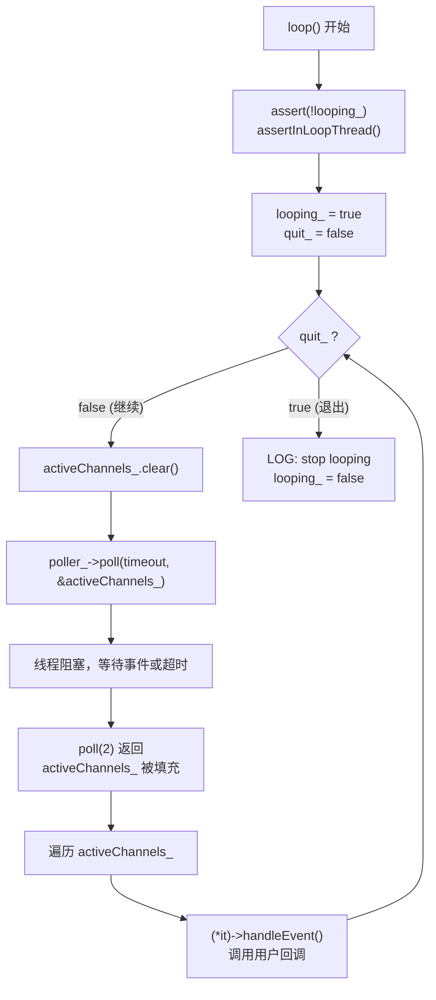
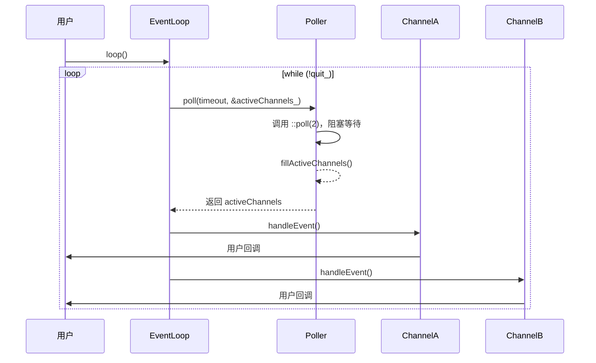
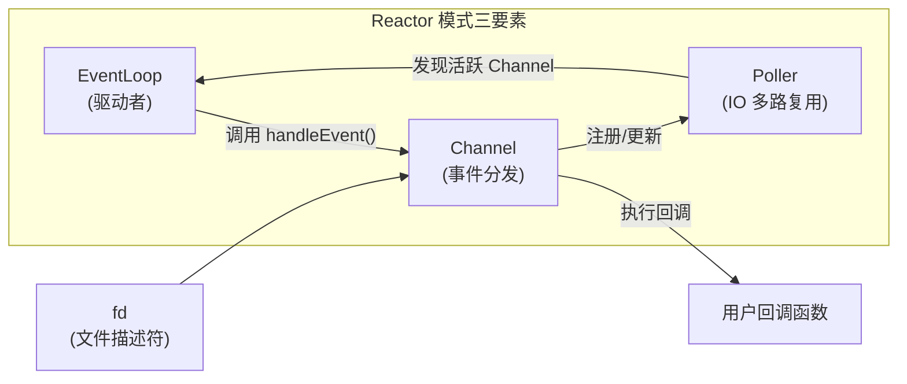
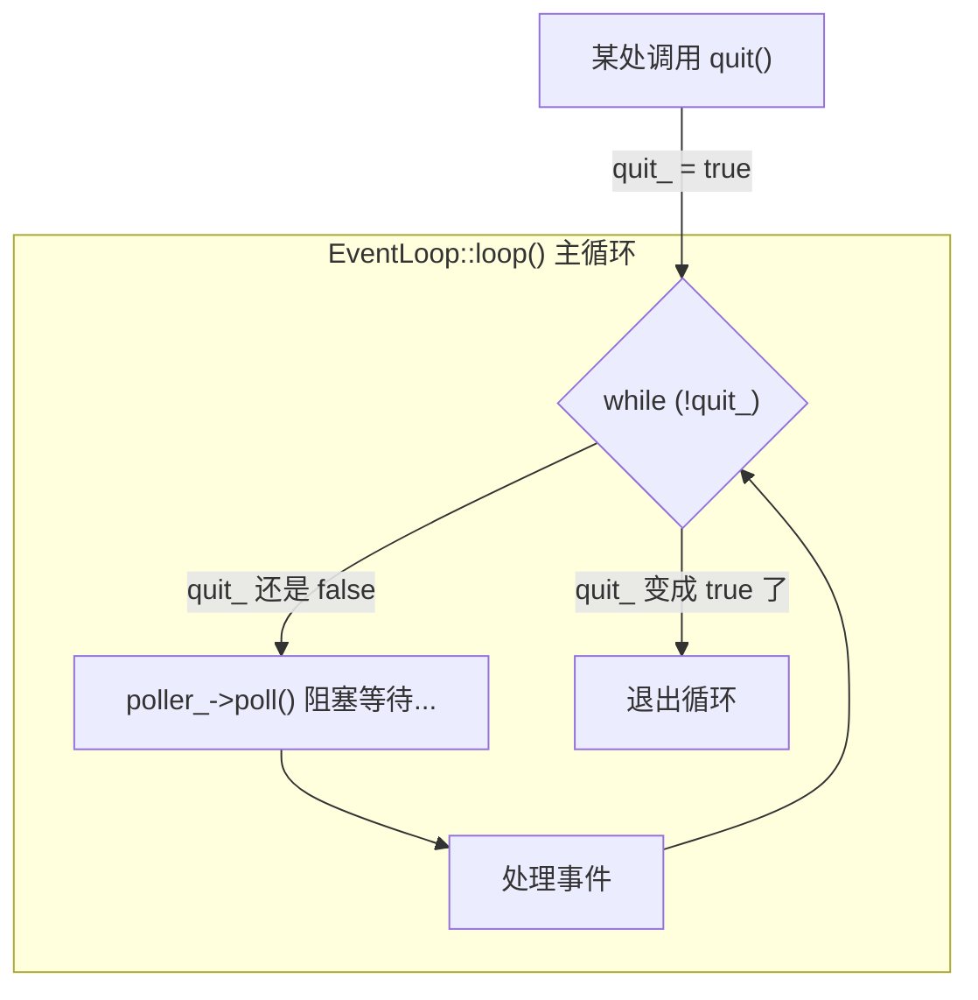
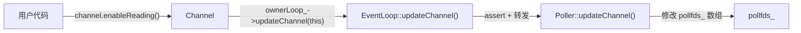
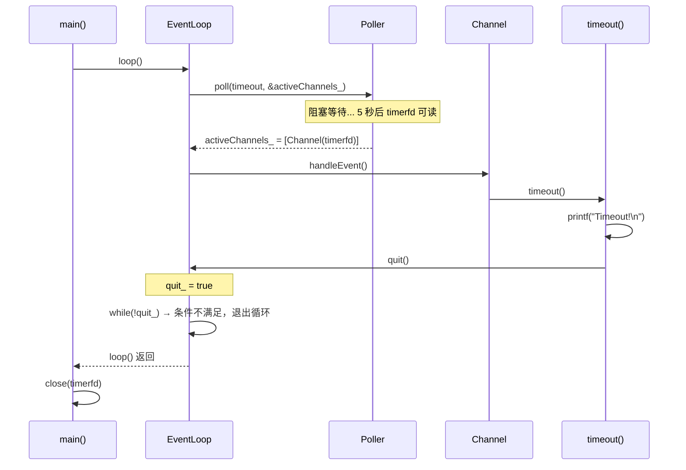

# EventLoop 与 Poller/Channel 协作构成 Reactor 模式

## 原话

> EventLoop class 新增了 `quit()` 成员函数，还加了几个数据成员，并在构造函数里初始化它们。注意 EventLoop 通过 `scoped_ptr` 来间接持有 Poller，因此 `EventLoop.h` 不必包含 `Poller.h`，只需前向声明 Poller class。为此，EventLoop 的析构函数必须在 `EventLoop.cc` 中显式定义。
>
> `EventLoop::loop()` 有了真正的工作内容，它调用 `Poller::poll()` 获得当前活动事件的 Channel 列表，然后依次调用每个 Channel 的 `handleEvent()` 函数。
>
> 以上几个 class 尽管简陋，却构成了 Reactor 模式的核心内容。

---

## 1. EventLoop 的新增成员

### 新增的数据成员

```cpp
// EventLoop.h（reactor/s01）
typedef std::vector<Channel*> ChannelList;

bool looping_;  /* atomic */
bool quit_;     /* atomic */
const pid_t threadId_;
boost::scoped_ptr<Poller> poller_;
ChannelList activeChannels_;
```

逐个解读：

| 成员 | 类型 | 作用 |
|------|------|------|
| `quit_` | `bool` | 退出标志，设为 `true` 时循环在下一轮退出 |
| `poller_` | `scoped_ptr<Poller>` | 间接持有 Poller 对象（IO 多路复用器） |
| `activeChannels_` | `vector<Channel*>` | 每次 `poll()` 返回后，存放有活跃事件的 Channel 列表 |
| `looping_` | `bool` | 标识当前是否正在 `loop()` 中 |
| `threadId_` | `pid_t` | 记录创建 EventLoop 的线程 ID |

### 为什么用 `scoped_ptr` 间接持有 Poller

```cpp
// EventLoop.h 中
class Poller;  // 前向声明，不需要 #include "Poller.h"

class EventLoop {
    boost::scoped_ptr<Poller> poller_;  // 只需要知道 Poller 是个类即可
};
```

如果 EventLoop 直接把 Poller 作为值成员（`Poller poller_;`），编译器需要在编译 `EventLoop.h` 时就知道 Poller 的完整定义（大小、构造函数等），这就必须 `#include "Poller.h"`。

而用 `scoped_ptr<Poller>`（智能指针），编译器只需要知道"Poller 是一个类"就够了——因为指针的大小是固定的（8 字节），不需要知道 Poller 有多大。

**好处**：

- `EventLoop.h` 不需要包含 `Poller.h`，减少了头文件依赖。
- 如果 Poller 的实现（`.h`）发生变化，只有 `EventLoop.cc` 需要重新编译，包含 `EventLoop.h` 的其他文件不受影响。

> `scoped_ptr` 是 Boost 提供的智能指针，功能类似 C++11 的 `std::unique_ptr`——独占所有权，离开作用域自动 `delete`。

### 为什么析构函数必须在 `.cc` 中定义

```cpp
// EventLoop.cc 中
EventLoop::~EventLoop() {
    // ...
}
```

这是 `scoped_ptr` + 前向声明带来的一个 **硬性要求**。

原因：`scoped_ptr` 析构时会 `delete` 它持有的 Poller 对象。`delete` 需要知道 Poller 的完整定义（特别是析构函数），否则编译器会报"incomplete type"错误。

- 如果 EventLoop 的析构函数是编译器自动生成的（隐式定义），它会在 `EventLoop.h` 中展开——而 `.h` 中只有前向声明，没有 Poller 的完整定义，编译失败。
- 把析构函数放到 `EventLoop.cc` 中显式定义，`.cc` 文件会 `#include "Poller.h"`，此时 Poller 的完整定义可用，`delete` 可以正确执行。

```
EventLoop.h:   class Poller;  ← 只有前向声明
               ~EventLoop();  ← 声明，不在这里定义

EventLoop.cc:  #include "Poller.h"  ← 完整定义可用
               EventLoop::~EventLoop() { }  ← scoped_ptr 析构 Poller 时能正确 delete
```


---

## 2. `loop()` 的工作流程

### 源码

```cpp
// EventLoop.cc（reactor/s01）
void EventLoop::loop()
{
    assert(!looping_);
    assertInLoopThread();
    looping_ = true;
    quit_ = false;

    while (!quit_)
    {
        activeChannels_.clear();
        poller_->poll(kPollTimeMs, &activeChannels_);
        for (ChannelList::iterator it = activeChannels_.begin();
             it != activeChannels_.end(); ++it)
        {
            (*it)->handleEvent();
        }
    }

    LOG_TRACE << "EventLoop " << this << " stop looping";
    looping_ = false;
}
```

### 逐步解读

1. **前置检查**：`assert(!looping_)` 确保不会重复进入循环；`assertInLoopThread()` 确保在正确的 IO 线程。

2. **设置状态**：`looping_ = true`、`quit_ = false`。

3. **主循环 `while (!quit_)`**：这是 Reactor 的核心——不断循环处理事件。每一轮做三件事：

   - **清空活跃列表**：`activeChannels_.clear()`——上一轮的结果不再需要。
   - **调用 Poller**：`poller_->poll(kPollTimeMs, &activeChannels_)`——调用 `poll(2)` 等待事件，将有事件的 Channel 填入 `activeChannels_`。
   - **分发事件**：遍历 `activeChannels_`，对每个 Channel 调用 `handleEvent()`——这会触发用户注册的回调函数。

4. **退出循环**：当 `quit_` 被设为 `true` 时，下一次检查 `while (!quit_)` 条件不满足，退出。

### 流程图



### 时序图（对应书中图 8-1）



**关键点**：Poller 只负责发现"谁有事件"（IO multiplexing），EventLoop 负责"调用回调"（事件分发），两者职责清晰分离。

---

## 3. 三个类构成 Reactor 核心

尽管 EventLoop、Poller、Channel 在教学版中非常简陋，但它们已经构成了 Reactor 模式的完整骨架。

### 职责划分



| 类 | 职责 | 一句话描述 |
|----|------|----------|
| **EventLoop** | 驱动整个事件循环 | "大管家"——循环调用 Poller，再分发事件给 Channel |
| **Poller** | IO 多路复用的封装 | "耳目"——调用 `poll(2)`，发现哪些 fd 有事件 |
| **Channel** | fd 的事件分发器 | "传令兵"——记录 fd 关心什么事件、事件来了执行什么回调 |

### 为什么这三个就够了

一个 Reactor 需要回答三个问题：

1. **怎么等待事件？** → Poller 封装 `poll(2)` / `epoll(4)`。
2. **事件来了通知谁？** → Channel 把 fd 和回调绑定在一起。
3. **谁来驱动这个过程？** → EventLoop 的 `while(!quit_)` 循环。

这三个类各自做一件事，组合起来就是完整的 Reactor。后续的所有功能（定时器、跨线程调用、TCP 连接管理）都建立在这个骨架之上。

---

## 4. `quit()` 的机制和延迟

### 源码

```cpp
// EventLoop.cc
void EventLoop::quit()
{
    quit_ = true;
    // wakeup();
}
```

### 工作原理

`quit()` 只做了一件事：把 `quit_` 标志设为 `true`。

**它不是中断，不是 signal，只是设一个 bool 标志。**

这意味着：



### 为什么不是立刻生效

`quit()` 生效的时机是 `loop()` 中 **下一次检查** `while (!quit_)` 条件时。如果此刻 `loop()` 正阻塞在 `poller_->poll()` 调用中（在等待事件），那么必须等到：

- 有某个 fd 上的事件发生，`poll(2)` 返回；或者
- `poll(2)` 的超时时间到了

之后才会回到 `while (!quit_)` 检查点，发现 `quit_` 已经是 `true`，退出循环。

### 延迟有多长

| 场景 | 延迟 |
|------|------|
| `quit()` 在 `handleEvent()` 中被调用（同一个 IO 线程） | 几乎为 0——当前这一轮事件处理完后立刻退出 |
| `quit()` 在其他线程调用，且 `poll(2)` 刚开始阻塞 | 最长可达 `kPollTimeMs`（超时时间），可能是数秒 |

### 将来的改进

源码中注释掉的 `// wakeup()` 暗示了未来的优化：通过 `eventfd` 或 `pipe` 主动唤醒正在阻塞的 `poll(2)`，让 `quit()` 可以几乎立刻生效。在后续的 muduo 完整版本中，这个 `wakeup()` 机制确实被实现了。

### `quit()` vs 中断/signal 的区别

| 特性 | `quit()`（设标志） | 中断/signal |
|------|-------------------|------------|
| 生效时机 | 下一次循环检查时 | 立刻打断当前执行 |
| 安全性 | 安全——在正常流程中检查 | 危险——可能打断任意代码，包括不可重入函数 |
| 实现复杂度 | 简单——一个 bool 变量 | 复杂——需要处理信号安全、重入等问题 |

muduo 选择"设标志"的方式，是因为**安全性远比实时性重要**。在 Reactor 模型中，所有操作都在事件循环中有序执行，用标志来控制退出是最自然、最安全的做法。

---

## 5. `updateChannel()` 的转发

### 源码

```cpp
// EventLoop.cc
void EventLoop::updateChannel(Channel* channel)
{
    assert(channel->ownerLoop() == this);
    assertInLoopThread();
    poller_->updateChannel(channel);
}
```

### 解读

这个函数只做了三件事：

1. **`assert(channel->ownerLoop() == this)`**：检查这个 Channel 确实属于当前 EventLoop。防止把 Channel 注册到错误的 EventLoop。

2. **`assertInLoopThread()`**：确保当前在 IO 线程中调用。`updateChannel()` 会修改 Poller 内部的 `pollfds_` 数组，不是线程安全的操作。

3. **`poller_->updateChannel(channel)`**：直接转发给 Poller 处理。

### 设计意图

EventLoop **不关心** Poller 内部是怎么管理 Channel 列表的（是用 `vector<pollfd>` + `map` 还是其他方式）。它只负责：

- 做好入口检查（断言）
- 转发调用

这体现了 **封装** 原则：EventLoop 只依赖 Poller 的接口（`updateChannel`），不依赖其实现细节。将来把 Poller 从 `poll` 换成 `epoll`，EventLoop 的代码一行都不用改。



---

## 6. test3.cc 示例分析

### 完整源码

```cpp
// reactor/s01/test3.cc
#include <sys/timerfd.h>

muduo::EventLoop* g_loop;

void timeout()
{
    printf("Timeout!\n");
    g_loop->quit();
}

int main()
{
    muduo::EventLoop loop;
    g_loop = &loop;

    int timerfd = ::timerfd_create(CLOCK_MONOTONIC, TFD_NONBLOCK | TFD_CLOEXEC);
    muduo::Channel channel(&loop, timerfd);
    channel.setReadCallback(timeout);
    channel.enableReading();

    struct itimerspec howlong;
    bzero(&howlong, sizeof howlong);
    howlong.it_value.tv_sec = 5;
    ::timerfd_settime(timerfd, 0, &howlong, NULL);

    loop.loop();

    ::close(timerfd);
}
```

### 逐行解读

#### 第一步：创建 EventLoop 和全局指针

```cpp
muduo::EventLoop loop;   // 在栈上创建 EventLoop（one loop per thread）
g_loop = &loop;          // 保存指针，让 timeout() 回调函数能访问它
```

#### 第二步：创建 timerfd

```cpp
int timerfd = ::timerfd_create(CLOCK_MONOTONIC, TFD_NONBLOCK | TFD_CLOEXEC);
```

`timerfd` 是 Linux 提供的定时器文件描述符。它的特点是：**到时间了，这个 fd 变为可读**。这样就能把定时器事件统一到 `poll(2)` 的事件循环中，不需要额外的定时器机制。

| 参数 | 含义 |
|------|------|
| `CLOCK_MONOTONIC` | 使用单调时钟（不受系统时间修改影响） |
| `TFD_NONBLOCK` | 非阻塞模式 |
| `TFD_CLOEXEC` | `exec` 时自动关闭此 fd |

#### 第三步：创建 Channel 并注册回调

```cpp
muduo::Channel channel(&loop, timerfd);  // Channel 绑定 loop 和 fd
channel.setReadCallback(timeout);        // 当 timerfd 可读时，调用 timeout()
channel.enableReading();                 // 开始关注"可读"事件
```

`enableReading()` 内部会调用 `ownerLoop_->updateChannel(this)`，最终通过 Poller 把这个 timerfd 加入到 `pollfds_` 数组中，让 `poll(2)` 监视它。

#### 第四步：设定定时器

```cpp
struct itimerspec howlong;
bzero(&howlong, sizeof howlong);
howlong.it_value.tv_sec = 5;    // 5 秒后触发
::timerfd_settime(timerfd, 0, &howlong, NULL);
```

设定一个 **5 秒后单次触发** 的定时器。5 秒到了，timerfd 变为可读。

> `it_value` 是首次触发时间，`it_interval` 是之后的重复间隔。这里 `it_interval` 没设（默认 0），所以只触发一次。

#### 第五步：进入事件循环

```cpp
loop.loop();  // 进入 while(!quit_) 主循环
```

程序在这里阻塞，等待事件发生。

#### 执行流程



#### 第六步：清理

```cpp
::close(timerfd);  // 关闭文件描述符
```

`loop.loop()` 返回后，关闭 timerfd。EventLoop 和 Channel 在 `main()` 结束时自动析构。

---

## 7. Level Trigger（水平触发）解释

### 什么是 Level Trigger

`poll(2)` 和 `epoll` 的默认模式都是 **Level Trigger（LT，水平触发）**：

> 只要 fd 处于"就绪"状态，**每次** 调用 `poll(2)` 都会报告它。

与之相对的是 **Edge Trigger（ET，边沿触发）**：

> 只在 fd 从"未就绪"变为"就绪"的那个 **瞬间** 报告一次。

用生活例子理解：

| 模式 | 类比 |
|------|------|
| Level Trigger | 门铃一直响——只要有人在门口站着，铃就一直响 |
| Edge Trigger | 门铃只响一次——有人按了门铃的瞬间响一下，之后不管你开没开门 |

### 为什么 `timeout()` 中必须 `read()` timerfd

原文指出：

> 由于 `poll(2)` 是 level trigger，在 `timeout()` 中应该 `read()` timerfd，否则下次会立刻触发。

timerfd 到时间后变为可读，内核会在 timerfd 的缓冲区中写入一个 8 字节的整数（表示超时次数）。

- 如果你 **不 `read()`**：timerfd 缓冲区中仍然有数据→fd 仍然处于"可读"状态→下次 `poll(2)` 会立刻再次报告它可读→`handleEvent()` 会再次被调用→无限循环。
- 如果你 **`read()` 了**：数据被读走→fd 不再处于"可读"状态→下次 `poll(2)` 不会报告它→正常。

```
不 read() 的后果（Level Trigger）:

poll() → timerfd 可读 → handleEvent() → timeout()（没有 read）
poll() → timerfd 仍然可读 → handleEvent() → timeout()（又触发！）
poll() → timerfd 仍然可读 → handleEvent() → timeout()（又触发！）
...（死循环）
```

> 教学版的 test3.cc 中 `timeout()` 直接调用了 `quit()`，所以循环不会继续，不会死循环。但在一般情况下，如果回调不退出循环，就必须 `read()` 消耗掉数据。

### Level Trigger 在调试中的好处

原文还提到：

> 在现阶段采用 level trigger 的好处之一是可以通过 strace 命令直观地看到每次 `poll(2)` 的参数列表，容易检查程序的行为。

用 `strace` 跟踪程序的系统调用：

```bash
strace ./test3
```

每次 `poll(2)` 调用都能看到完整的参数：

```
poll([{fd=5, events=POLLIN}], 1, 10000) = 1 ([{fd=5, revents=POLLIN}])
```

这让你能清楚地看到：

- 监视了哪些 fd（`fd=5`）
- 关心什么事件（`events=POLLIN`）
- 哪些 fd 有事件发生（`revents=POLLIN`）
- 返回了几个活跃 fd（`= 1`）

Level Trigger 下，如果忘了 `read()`，你会在 strace 中看到 `poll()` 不断立刻返回，一眼就能发现问题。而 Edge Trigger 下这类问题更难察觉。

---

## 8. 常见疑问小结

### Q1：为什么用 `scoped_ptr` 而不是直接的 Poller 成员变量？

为了**前向声明**。直接用 `Poller poller_;` 需要编译器知道 Poller 的完整定义（大小），必须 `#include "Poller.h"`。而 `scoped_ptr<Poller>` 只需要知道 Poller 是个类名（前向声明即可），因为指针的大小是固定的。这减少了头文件依赖，加快编译速度。

### Q2：`quit_` 为什么标注了 `/* atomic */`？

因为 `quit_` 可能在一个线程中被 `quit()` 设置，而在另一个线程的 `loop()` 中被读取。注释 `/* atomic */` 表示这个变量在正式版中应该是原子变量（`std::atomic<bool>`），以保证线程间的可见性。教学版简化了，直接用 `bool`。

### Q3：`activeChannels_` 为什么存 `Channel*` 而不是 `Channel`？

三个原因：

1. **避免拷贝**：Channel 对象不应被拷贝（它绑定了特定的 fd 和回调）。
2. **多态支持**：指针可以指向 Channel 的子类（虽然教学版没用到）。
3. **Poller 中已有原始 Channel 对象**：`activeChannels_` 只是引用 Poller `channels_` 映射中已有的 Channel，不应该重复存储。

### Q4：`loop()` 中为什么先 `clear()` 再 `poll()`？

`activeChannels_` 是一个 `vector`，上一轮的结果不需要了。先 `clear()` 清空，再让 `poll()` 往里填新的结果。如果不清空，新旧结果会混在一起。

### Q5：test3.cc 中为什么用全局指针 `g_loop`？

因为 `timeout()` 是一个普通函数（不是 Channel 的成员函数），它需要访问 EventLoop 来调用 `quit()`。用全局指针是最简单的方式。在更正式的代码中，会用 `std::bind` 或 lambda 来绑定 EventLoop 指针，避免全局变量。

### Q6：`while (!quit_)` 改成 `while (true)` + 内部 `break` 行不行？

功能上可以，但 `while (!quit_)` 更清晰地表达了退出条件——"当 `quit_` 为 true 时退出"。这是循环不变量（loop invariant）的直接体现，代码意图一目了然。

---

## 9. 快速参考

| 项目 | 说明 |
|------|------|
| **EventLoop 新增成员** | `quit_`（退出标志）、`poller_`（scoped_ptr 持有）、`activeChannels_`（活跃 Channel 列表） |
| **`loop()` 工作内容** | `while(!quit_)` → `clear()` → `poll()` → `handleEvent()` |
| **Reactor 三要素** | EventLoop（驱动）、Poller（IO 复用）、Channel（事件分发） |
| **`quit()` 机制** | 设标志，非中断；下一轮循环检查时退出；阻塞中不立刻生效 |
| **`updateChannel()`** | EventLoop 做断言检查后转发给 Poller |
| **Level Trigger** | fd 就绪状态持续报告；必须 `read()` 消耗数据否则反复触发 |
| **`scoped_ptr` 技巧** | 间接持有 Poller，允许前向声明；析构函数必须在 `.cc` 中定义 |
| **test3.cc** | timerfd 5 秒定时器 → Channel 可读回调 → `timeout()` → `quit()` |
