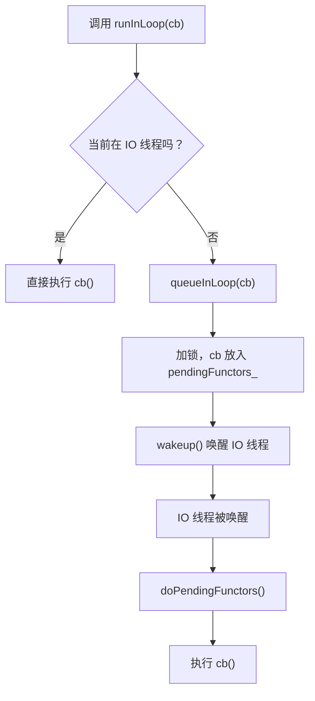
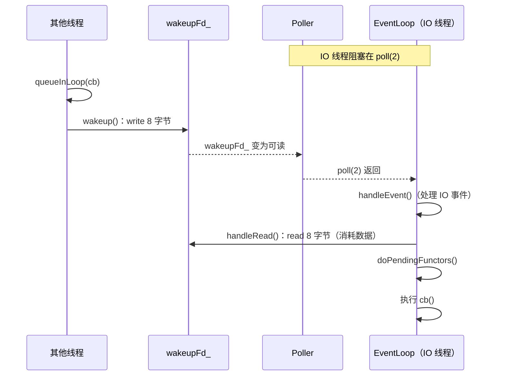
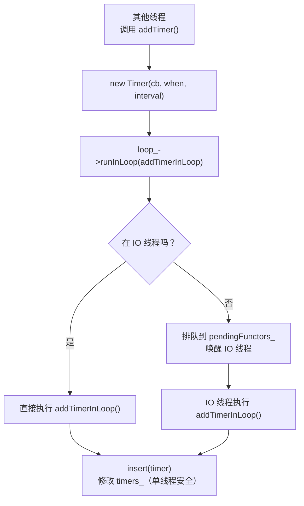
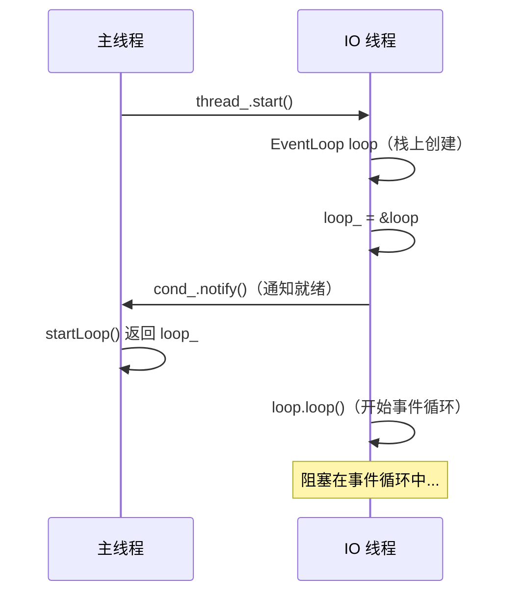

# Muduo runInLoop 跨线程任务调配理解说明

## 原话

> EventLoop 有一个非常有用的功能：在它的 IO 线程内执行某个用户任务回调，即 `EventLoop::runInLoop(const Functor& cb)`，其中 `Functor` 是 `boost::function<void()>`。如果用户在当前 IO 线程调用这个函数，回调会同步进行；如果用户在其他线程调用 `runInLoop()`，cb 会被加入队列，IO 线程会被唤醒来调用这个 Functor。

---

## 1. runInLoop 是什么

### 一句话

`runInLoop(cb)` 的意思是：**"请在 IO 线程里执行这个函数 cb"。**

### 两种情况

```cpp
void EventLoop::runInLoop(const Functor& cb)
{
    if (isInLoopThread()) {
        cb();               // 情况一：已经在 IO 线程，直接执行
    } else {
        queueInLoop(cb);    // 情况二：不在 IO 线程，排队 + 唤醒
    }
}
```



### 为什么需要这个功能

muduo 的核心设计原则是：**每个 EventLoop 的内部数据只在它自己的 IO 线程中访问，不加锁。**

但实际场景中，其他线程经常需要让 IO 线程做某件事。例如：

```cpp
// 计算线程想在 IO 线程中添加一个定时器
// 错误做法：直接调用（跨线程修改 TimerQueue，数据竞争！）
timerQueue->addTimer(cb, when, interval);

// 正确做法：通过 runInLoop 转到 IO 线程执行
loop->runInLoop([=]() {
    timerQueue->addTimer(cb, when, interval);  // 在 IO 线程中安全执行
});
```

**runInLoop 让跨线程操作变得安全，而且不需要在 TimerQueue 等内部组件中加锁。**

---

## 2. queueInLoop 的实现

```cpp
void EventLoop::queueInLoop(const Functor& cb)
{
    {
        MutexLockGuard lock(mutex_);
        pendingFunctors_.push_back(cb);   // 加锁，把 cb 放入队列
    }

    if (!isInLoopThread() || callingPendingFunctors_)
    {
        wakeup();                          // 必要时唤醒 IO 线程
    }
}
```

### 加锁放入队列

`pendingFunctors_` 是一个 `vector<Functor>`，会被多个线程同时访问：

- **其他线程**调用 `queueInLoop()` 往里面 `push_back`
- **IO 线程**在 `doPendingFunctors()` 中取出来执行

所以需要用 `mutex_` 保护。但注意：这个锁只保护 `push_back` 这一个操作，临界区非常短。

### "必要时唤醒"的两种条件

```cpp
if (!isInLoopThread() || callingPendingFunctors_)
{
    wakeup();
}
```

| 条件 | 含义 | 为什么要唤醒 |
|------|------|-----------|
| `!isInLoopThread()` | 调用者不在 IO 线程 | IO 线程此刻可能阻塞在 `poll(2)` 中，不唤醒的话要等到 poll 超时才能执行 cb |
| `callingPendingFunctors_` | IO 线程正在执行 `doPendingFunctors()` | 当前这一轮的 Functor 可能会再调用 `queueInLoop()` 添加新任务，如果不唤醒，新任务要等到下一次 poll 返回后才执行 |

**唯一不需要唤醒的情况**：在 IO 线程中调用 `queueInLoop()`，且不在 `doPendingFunctors()` 执行过程中。这时 cb 刚放入队列，而 IO 线程马上就会执行到 `doPendingFunctors()`（在本轮 loop 的末尾），不需要额外唤醒。


---

## 3. eventfd 唤醒机制

### 为什么需要唤醒

IO 线程在 `loop()` 中大部分时间都 **阻塞在 `poll(2)` 调用中**，等待 fd 上的事件。

如果其他线程往 `pendingFunctors_` 里放了一个任务，IO 线程正在 `poll` 中睡觉——谁来叫醒它？

```
IO 线程:
    while (!quit_) {
        poll(...)           ← 正在这里睡觉！不知道有新任务了
        handleEvents();
        doPendingFunctors();  ← 永远执行不到这里
    }
```

需要一种方式**打断 `poll(2)` 的阻塞**，让它立刻返回。

### 传统方案：pipe

创建一个管道（`pipe`），IO 线程监视管道的读端。其他线程往管道写端写一个字节，`poll(2)` 就会发现管道可读并返回。

缺点：pipe 占用两个 fd（读端 + 写端），还需要管理缓冲区。

### 现代方案：eventfd（muduo 的选择）

`eventfd` 是 Linux 专门为事件通知设计的 fd，只占一个 fd，不需要管理缓冲区：

```cpp
int wakeupFd_ = ::eventfd(0, EFD_NONBLOCK | EFD_CLOEXEC);
```

| 操作 | 做什么 | 代码 |
|------|--------|------|
| 唤醒 | 往 eventfd 写 8 字节 | `wakeup()`: `write(wakeupFd_, &one, sizeof one)` |
| 响应 | 从 eventfd 读 8 字节 | `handleRead()`: `read(wakeupFd_, &one, sizeof one)` |

### 工作流程



### 对比

| 项目 | pipe | eventfd |
|------|------|---------|
| 占用 fd 数 | 2 个（读端 + 写端） | 1 个 |
| 缓冲区管理 | 需要（pipe 有内核缓冲区） | 不需要（eventfd 只是一个计数器） |
| 适用性 | 所有 Unix 系统 | Linux 2.6.22+ |
| 效率 | 稍低 | 更高 |

---

## 4. EventLoop 新增数据成员

```cpp
// EventLoop.h（reactor/s03）
private:
    void handleRead();           // wakeupFd_ 可读时的回调
    void doPendingFunctors();    // 执行 pendingFunctors_ 中的任务

    bool callingPendingFunctors_;  /* atomic */  // 是否正在执行 pending 任务
    int wakeupFd_;                               // eventfd 文件描述符
    boost::scoped_ptr<Channel> wakeupChannel_;   // 监视 wakeupFd_ 的 Channel
    MutexLock mutex_;                            // 保护 pendingFunctors_
    std::vector<Functor> pendingFunctors_;        // @GuardedBy mutex_
```

| 成员 | 作用 |
|------|------|
| `wakeupFd_` | eventfd，用于跨线程唤醒 |
| `wakeupChannel_` | 封装 `wakeupFd_` 的 Channel，注册到 Poller 监视其可读事件 |
| `callingPendingFunctors_` | 标记当前是否正在执行 `doPendingFunctors()`，用于判断是否需要唤醒 |
| `mutex_` | 互斥锁，保护 `pendingFunctors_`（这是 EventLoop 中**唯一需要锁**的地方） |
| `pendingFunctors_` | 待执行的任务队列，其他线程通过 `queueInLoop()` 往这里放任务 |

### 为什么 wakeupChannel_ 用 scoped_ptr 而不是直接成员

原文中解释了：

> unlike in TimerQueue, which is an internal class, we don't expose Channel to client.

`wakeupChannel_` 用 `scoped_ptr`（间接持有），这样 `EventLoop.h` 不需要 `#include "Channel.h"`，只需要前向声明 `class Channel;`。和 Poller 的设计思路相同——减少头文件依赖。

---

## 5. loop() 的改动

```cpp
while (!quit_)
{
    activeChannels_.clear();
    pollReturnTime_ = poller_->poll(kPollTimeMs, &activeChannels_);
    for (ChannelList::iterator it = activeChannels_.begin();
         it != activeChannels_.end(); ++it)
    {
        (*it)->handleEvent();
    }
    doPendingFunctors();   // ← 新增这一行
}
```

每一轮循环的末尾，在处理完所有 IO 事件后，执行 `doPendingFunctors()`——把其他线程排队过来的任务取出来执行。

```
每轮循环的三个阶段：
1. poll()            → 等待并获取活跃的 IO 事件
2. handleEvent()     → 处理 IO 事件（包括 wakeupFd_ 的读事件）
3. doPendingFunctors() → 执行跨线程排队过来的任务   ← 新增
```

---

## 6. doPendingFunctors 的 swap 技巧

```cpp
void EventLoop::doPendingFunctors()
{
    std::vector<Functor> functors;
    callingPendingFunctors_ = true;

    {
        MutexLockGuard lock(mutex_);
        functors.swap(pendingFunctors_);    // 关键：swap 而不是逐个取
    }

    for (size_t i = 0; i < functors.size(); ++i)
    {
        functors[i]();                      // 在锁外面执行回调
    }
    callingPendingFunctors_ = false;
}
```

### 为什么不在锁里面逐个执行

直觉做法：

```cpp
// 错误做法
void doPendingFunctors()
{
    MutexLockGuard lock(mutex_);      // 加锁
    for (auto& f : pendingFunctors_)  // 在锁里面遍历执行
    {
        f();                          // 用户回调可能耗时很长
    }                                 // 整个过程其他线程都被锁住！
    pendingFunctors_.clear();
}
```

问题：
- **临界区太长**：用户回调可能执行很久（比如数据库操作），期间其他线程的 `queueInLoop()` 全部阻塞在 `mutex_` 上。
- **可能死锁**：如果用户回调内部再调用 `queueInLoop()`，它会尝试获取同一把 `mutex_`，死锁！

### swap 的好处

```cpp
{
    MutexLockGuard lock(mutex_);
    functors.swap(pendingFunctors_);  // O(1)，只交换两个指针
}
// 到这里锁已经释放！

for (auto& f : functors)
{
    f();  // 在锁外面执行，不阻塞其他线程的 queueInLoop
}
```

`swap` 只交换 vector 内部的三个指针（首地址、大小、容量），时间复杂度 O(1)。

交换后：
- `functors` 拿走了所有待执行的任务
- `pendingFunctors_` 变成空的，可以接收新任务
- 锁可以立刻释放

```
交换前：
  pendingFunctors_ = [cb1, cb2, cb3]
  functors         = []

交换后（O(1)，只交换指针）：
  pendingFunctors_ = []                ← 空了，其他线程可以继续往里放
  functors         = [cb1, cb2, cb3]   ← 在锁外面慢慢执行
```

### callingPendingFunctors_ 的作用

回顾 `queueInLoop` 中的唤醒条件：

```cpp
if (!isInLoopThread() || callingPendingFunctors_)
{
    wakeup();
}
```

为什么 `callingPendingFunctors_` 为 true 时也要唤醒？

假设在执行 `doPendingFunctors()` 的某个 Functor 时，这个 Functor 内部又调用了 `queueInLoop()` 添加了新任务：


```
doPendingFunctors() 执行中...
    swap 已完成 → pendingFunctors_ 此刻为空

    functors[0]()  → 这个函数内部调用了 queueInLoop(newCb)
                      → newCb 被放入 pendingFunctors_
                      → 此时 pendingFunctors_ = [newCb]，不是空的
    
    functors 全部执行完毕，doPendingFunctors() 返回
    → 回到 loop() 循环顶部 → poll(2)

    如果不 wakeup：
      → poll(2) 阻塞，等待 fd 事件或超时（最多 10 秒）
      → newCb 虽然已经在 pendingFunctors_ 中，但要等 poll 返回后才能执行
      → 延迟太大！

    如果 wakeup：
      → eventfd 可读 → poll(2) 立刻返回
      → 马上执行 doPendingFunctors() → newCb 被及时执行
```

所以 `callingPendingFunctors_ == true` 时必须 `wakeup()`，确保 `newCb` 能在下一轮循环中被及时执行。

---

## 7. TimerQueue 线程安全改造

### 之前的问题

在前一节中，`EventLoop::runAfter()` 直接调用 `TimerQueue::addTimer()`，而 `addTimer()` 内部修改 `timers_`（一个 `std::set`）。如果从其他线程调用 `runAfter()`，就会出现数据竞争。

### 改造方法

把 `addTimer()` 拆成两层：

```cpp
// ---------------------------------------------------------------
// 第一层：addTimer（接待员）
// 作用：接收请求，转交给 IO 线程。
// 任何线程都可以调用它。它自己不直接修改 timers_，
// 而是通过 runInLoop 把实际操作转交给 IO 线程，让IO线程修改timers_, 避免数据竞争。
// ---------------------------------------------------------------
TimerId TimerQueue::addTimer(const TimerCallback& cb,
                             Timestamp when,
                             double interval)
{
    Timer* timer = new Timer(cb, when, interval);  // 创建定时器对象
    loop_->runInLoop(
        boost::bind(&TimerQueue::addTimerInLoop, this, timer));  // 把"添加定时器"这个操作转交给 IO 线程去做
    return TimerId(timer);
}

// ---------------------------------------------------------------
// 第二层：addTimerInLoop（实际操作者），在Eventloop的loop函数，doPendingFunctors--->addTimerInLoop--->修改timers_
// 作用：在 IO 线程中真正把定时器插入数据结构。
// 只在 IO 线程中被执行（assertInLoopThread 断言保证）。
// 如果新插入的定时器是最早到期的，需要重设 timerfd_ 的超时时间。
// ---------------------------------------------------------------
void TimerQueue::addTimerInLoop(Timer* timer)
{
    loop_->assertInLoopThread();              // 断言：必须在 IO 线程
    bool earliestChanged = insert(timer);     // 安全地修改 timers_
    if (earliestChanged)
    {
        resetTimerfd(timerfd_, timer->expiration());  // 重设 timerfd_ 超时时间
    }
}
```




### 效果

- `timers_`（`std::set`）**始终只在 IO 线程被修改**，无须加锁。
- `addTimer()` 可以从任意线程安全调用——跨线程时自动转发到 IO 线程执行。
- 锁只存在于 `pendingFunctors_` 的 `push_back` 操作中，临界区极短。

---

## 8. EventLoopThread 类

### one loop per thread 的实现

muduo 提倡"one loop per thread"——每个 IO 线程运行一个 EventLoop。`EventLoopThread` 就是把这两者打包在一起的便利类：**创建一个线程，在这个线程中运行一个 EventLoop。**

### startLoop()

```cpp
EventLoop* EventLoopThread::startLoop()
{
    assert(!thread_.started());
    thread_.start();                      // 启动线程，thread_.start() 一调用，操作系统创建新线程，新线程自动从 threadFunc() 开始执行。

    {
        MutexLockGuard lock(mutex_);
        while (loop_ == NULL)
        {
            cond_.wait();                 // 等待线程函数创建好 EventLoop
        }
    }
    return loop_;                         // 返回 EventLoop 指针
}
```

`startLoop()` 启动线程后，用条件变量等待 `threadFunc()` 把 EventLoop 创建好。这是因为 EventLoop 必须在**它自己的线程中创建**（构造函数会记录 `threadId_`），所以不能在调用者线程中创建再传递过去。

### threadFunc()

```cpp
void EventLoopThread::threadFunc()
{
    EventLoop loop;                       // 在栈上创建 EventLoop

    {
        MutexLockGuard lock(mutex_);
        loop_ = &loop;                    // 把地址告诉主线程
        cond_.notify();                   // 通知主线程：EventLoop 已就绪
    }

    loop.loop();                          // 进入事件循环（阻塞直到 quit）
    //assert(exiting_);
}
```


两个线程的交互时序：



### EventLoop 的生命期

EventLoop 是 `threadFunc()` 的**栈上变量**，它的生命期与线程函数相同。`threadFunc()` 返回时，EventLoop 析构。

这意味着 `startLoop()` 返回的 `loop_` 指针在 `threadFunc()` 退出后会变成空悬指针。不过在服务器程序中，IO 线程通常运行到进程退出，所以这不是实际问题。

---

## 9. quit() 的改进

```cpp
void EventLoop::quit()
{
    quit_ = true;
    if (!isInLoopThread())
    {
        wakeup();         // 跨线程调用时唤醒，让 loop 尽快检查 quit_
    }
}
```

### 与之前的区别

之前的 `quit()` 只是设置 `quit_ = true`，不唤醒。跨线程调用时延迟可能长达 `kPollTimeMs`。

现在加了 `wakeup()`：如果不在 IO 线程调用 `quit()`，立刻唤醒 IO 线程，让它从 `poll(2)` 中返回并退出循环。

### 思考题：为什么在 IO 线程调用 quit() 不必 wakeup()？

因为在 IO 线程中调用 `quit()` 时，IO 线程一定**不在 `poll(2)` 中阻塞**——它正在执行某个回调函数（比如 `handleEvent()` 或 `doPendingFunctors()` 中的某个 Functor）。设置完 `quit_ = true` 后，回调返回，继续执行到 `while (!quit_)` 检查点，发现条件不满足，自然退出循环。不需要唤醒自己。

---

## 10. 常见疑问小结

### Q1：runInLoop 和 queueInLoop 有什么区别？

- `runInLoop`：如果在 IO 线程就直接执行，否则调用 `queueInLoop`。
- `queueInLoop`：无论在哪个线程，都是放入队列 + 可能唤醒。

`runInLoop` 是对外接口，`queueInLoop` 是它的内部实现路径之一。

### Q2：为什么 mutex_ 只保护 pendingFunctors_ 的 push_back，不保护执行？

因为 `doPendingFunctors()` 用 `swap` 把任务取走后，在锁外执行。执行期间 `pendingFunctors_` 已经是空的，其他线程可以自由往里 `push_back`，互不干扰。

### Q3：EventLoop 中只有 pendingFunctors_ 需要加锁吗？

是的。EventLoop 中的其他所有数据（`poller_`、`activeChannels_`、`timerQueue_` 等）都只在 IO 线程中访问，不存在竞争，不需要加锁。`pendingFunctors_` 是唯一暴露给其他线程的数据成员。

### Q4：wakeup() 写入的 8 字节有什么含义？

没有特别含义。`eventfd` 内部维护一个 `uint64_t` 计数器，`write` 会把写入的值累加到计数器上，`read` 会读出当前值并清零。我们只是利用"写入使 fd 变为可读"这个特性来唤醒 `poll(2)`，具体写入什么值不重要（代码中写的是 `1`）。

### Q5：如果多个线程同时 wakeup()，会不会有问题？

不会。`eventfd` 是线程安全的，多次 `write` 只是把计数器累加。IO 线程的 `handleRead()` 一次 `read` 就能清掉计数器。即使多次唤醒，也只是让 `poll(2)` 多返回几次，`doPendingFunctors()` 发现队列为空就直接跳过，没有副作用。

### Q6：doPendingFunctors() 不反复执行直到 pendingFunctors_ 为空，是有意的吗？

是有意的。原文指出：

> muduo 这里没有反复执行 `doPendingFunctors()` 直到 `pendingFunctors_` 为空，这是有意的，否则 IO 线程有可能陷入死循环，无法处理 IO 事件。

如果一直处理 pending 任务，而任务又不断产生新任务，IO 线程就永远停在 `doPendingFunctors()` 里，不会回到 `poll(2)` 去处理 socket 上的 IO 事件。每轮循环只执行一批（swap 出来的那些），新产生的任务留到下一轮，保证 IO 事件不被饿死。

---

## 11. 快速参考

| 项目 | 说明 |
|------|------|
| **runInLoop(cb)** | 在 IO 线程执行 cb；同线程直接执行，跨线程排队 + 唤醒 |
| **queueInLoop(cb)** | 加锁放入 `pendingFunctors_`，必要时 `wakeup()` |
| **唤醒方式** | `eventfd`：write 8 字节唤醒，read 8 字节消耗 |
| **唤醒条件** | 不在 IO 线程，或正在执行 `doPendingFunctors()` |
| **doPendingFunctors** | swap 取走任务 → 锁外执行 → 缩小临界区 + 避免死锁 |
| **TimerQueue 改造** | `addTimer` → `runInLoop(addTimerInLoop)`，保证 `insert` 在 IO 线程执行 |
| **EventLoopThread** | 封装"一个线程 + 一个 EventLoop"；条件变量同步创建过程 |
| **quit() 改进** | 跨线程调用时 `wakeup()` 立刻唤醒；同线程无须唤醒 |
| **唯一加锁的地方** | `pendingFunctors_` 的 `push_back` 和 `swap` |
