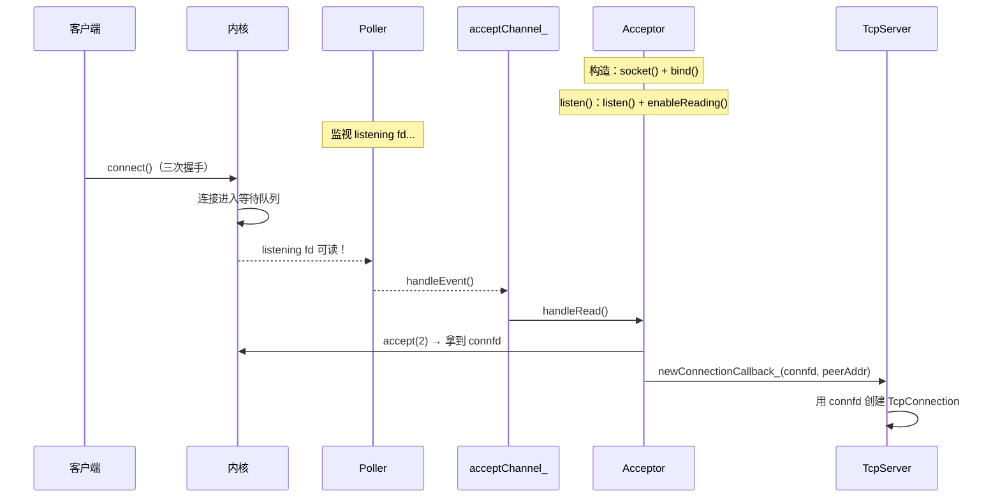
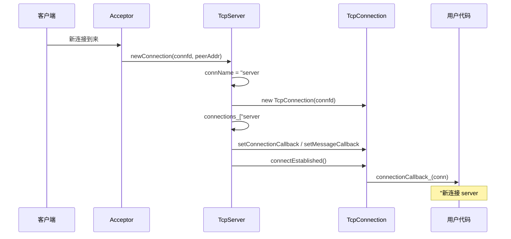
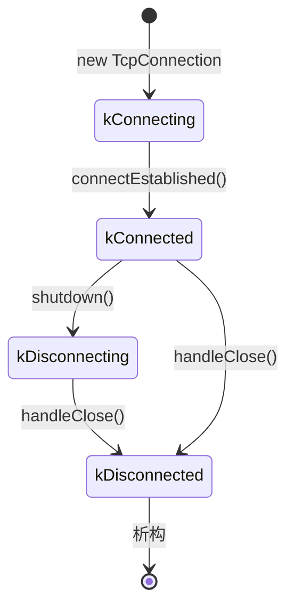
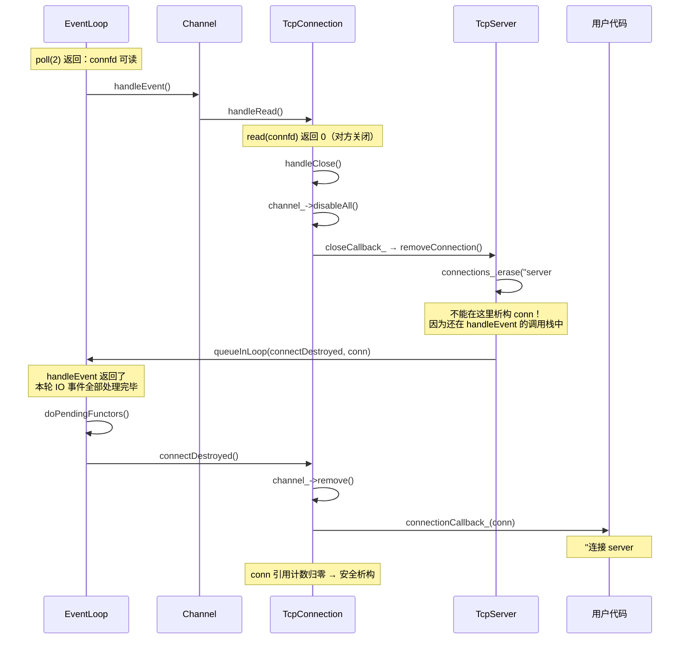
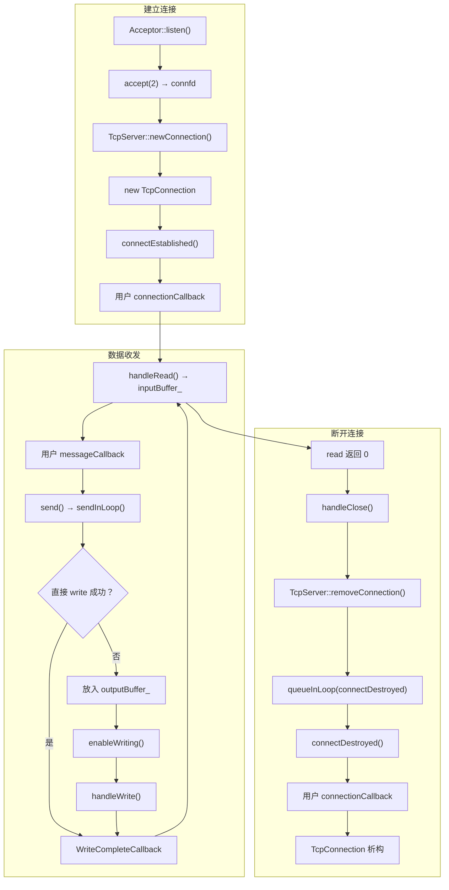

# Muduo TCP 网络库精华总结（8.4 - 8.13）

---

## 1. 事件循环的一次迭代

从 `poll(2)` 返回到再次调用 `poll(2)` 阻塞，称为**一次事件循环**。每次循环中，回调的执行顺序如下：

```
┌─────────────────────────────────────────────────┐
│                  一次事件循环                      │
│                                                   │
│   poll(2) 返回                                    │
│       │                                           │
│       ▼                                           │
│   IO handlers（处理 IO 事件）◄──── timers          │
│       │                          （timerfd 统一）  │
│       ▼                                           │
│   functors（doPendingFunctors）                    │
│       │                                           │
│       ▼                                           │
│   poll(2) 阻塞等待                                │
└─────────────────────────────────────────────────┘
```

**关键设计**：传统 Reactor 把 timers 作为循环中的独立步骤，muduo 利用 `timerfd` 把定时器事件统一到 IO handlers 中处理（timerfd 可读 = 定时器到期）。这样代码一致性更好，将来也可以灵活调整 timers 和 IO handlers 的优先级。


---

## 2. Acceptor 类（8.4）

### 先理解背景：一个 TCP 服务器要做什么

回忆一下，在之前的系统调用文档中，一个最简单的 TCP 服务器需要做 4 步：

```
1. socket()   → 创建一个 socket fd（"开一个窗口"）
2. bind()     → 绑定 IP 和端口（"把窗口开在哪个地址"）
3. listen()   → 开始监听（"挂上'营业中'的牌子"）
4. accept()   → 接受客户端连接（"有客人来了，给他开个专用通道"）
```

在裸写 C 代码时，这 4 步是程序员自己写的。**Acceptor 就是把这 4 步封装成一个类**，让 TcpServer 不用操心这些底层细节。

### Acceptor 是什么

用生活例子理解：

```
Acceptor = 酒店前台

- 前台有一个"总电话"（listening socket）→ 绑定在酒店地址（IP:端口）上
- 前台一直等电话（listen）
- 有客人打电话来预定（客户端 connect）→ 前台接电话（accept）
- 前台不负责服务客人，只是登记后转交给客房部（TcpServer）
- 客房部给客人分配房间（TcpConnection）
```

**Acceptor 只做一件事：在指定的 IP:端口 上等待新客户端连接，连接来了就通知 TcpServer。**

### Acceptor 的成员

```cpp
class Acceptor : boost::noncopyable {
    EventLoop* loop_;                           // 所属的事件循环
    Socket acceptSocket_;                       // listening socket（RAII 管理 fd）
    Channel acceptChannel_;                     // 监视 acceptSocket_ 上的"可读"事件
    NewConnectionCallback newConnectionCallback_;  // 新连接到来时的回调（由 TcpServer 设置）
    bool listenning_;                           // 是否正在监听
};
```

成员之间的关系：

```
acceptSocket_ （listening fd）
     │
     ▼
acceptChannel_（封装 fd，告诉 Poller："帮我盯着这个 fd，有人连接就通知我"）
     │
     ▼
Poller 发现 fd 可读 → Channel::handleEvent() → Acceptor::handleRead()
     │
     ▼
accept(2) 拿到新连接的 connfd → newConnectionCallback_(connfd) 通知 TcpServer
```

### Acceptor 的一生（按时间顺序）

#### 第一步：构造函数 — 创建 socket 并绑定地址

```cpp
Acceptor::Acceptor(EventLoop* loop, const InetAddress& listenAddr)
    : loop_(loop),
      acceptSocket_(sockets::createNonblockingOrDie()),  // ① socket(2)：创建 fd
      acceptChannel_(loop, acceptSocket_.fd()),          // 用 Channel 封装这个 fd
      listenning_(false)
{
    acceptSocket_.setReuseAddr(true);        // 允许端口复用（服务器重启时不用等）
    acceptSocket_.bindAddress(listenAddr);   // ② bind(2)：绑定 IP:端口
    acceptChannel_.setReadCallback(
        boost::bind(&Acceptor::handleRead, this));  // 设置回调：fd 可读时调用 handleRead
}
```

此时 socket 已创建并绑定，但还**没有开始监听**。

#### 第二步：listen() — 开始监听

```cpp
void Acceptor::listen()
{
    loop_->assertInLoopThread();
    listenning_ = true;
    acceptSocket_.listen();           // ③ listen(2)：告诉内核"我准备好接受连接了"
    acceptChannel_.enableReading();   // 把 fd 注册到 Poller，开始监视"可读"事件
}
```

调用 `listen()` 后，内核开始为这个 socket 维护一个**连接队列**。客户端的 `connect()` 请求会经过三次握手后放入队列。

`enableReading()` 告诉 Poller："帮我盯着 listening fd，一旦有新连接（fd 可读），就通知我。"

#### 第三步：handleRead() — 接受新连接

当有客户端连接到来时：

```
客户端 connect() → 三次握手完成 → 连接进入内核队列
→ listening fd 变为"可读"
→ Poller 发现 → Channel::handleEvent()
→ 调用 Acceptor::handleRead()
```

```cpp
void Acceptor::handleRead()
{
    loop_->assertInLoopThread();
    InetAddress peerAddr(0);
    int connfd = acceptSocket_.accept(&peerAddr);  // ④ accept(2)：从队列中取出一个连接
    if (connfd >= 0) {
        if (newConnectionCallback_)
            newConnectionCallback_(connfd, peerAddr);  // 把 connfd 交给 TcpServer
        else
            sockets::close(connfd);  // 如果没人要这个连接，关掉
    }
}
```

`accept(2)` 返回一个**新的 fd**（connfd），这个 fd 代表与这个客户端的专属通道。后续数据收发都通过 connfd，listening fd 继续等待下一个客户端。

### 完整流程图



### listening fd 和 connfd 的区别

这是初学者最容易混淆的点：

```
listening fd（Acceptor 持有）：
  - 只有一个，从头到尾不变
  - 作用：等待新客户端连接
  - 类比：酒店前台的总电话

connfd（每个客户端一个）：
  - 每 accept 一次就产生一个新的
  - 作用：与某个客户端收发数据
  - 类比：客人入住后的房间内线电话
```

```
                    ┌──── connfd_1 ↔ 客户端A
listening fd ──────┼──── connfd_2 ↔ 客户端B
  (Acceptor)       ├──── connfd_3 ↔ 客户端C
                    └──── ...
```

### 创建非阻塞 socket

```cpp
int sockets::createNonblockingOrDie()
{
    int sockfd = ::socket(AF_INET,
                          SOCK_STREAM | SOCK_NONBLOCK | SOCK_CLOEXEC,
                          IPPROTO_TCP);
    if (sockfd < 0) LOG_SYSFATAL << "createNonblockingOrDie";
    return sockfd;
}
```

| 标志 | 含义 |
|------|------|
| `AF_INET` | IPv4 |
| `SOCK_STREAM` | TCP（可靠的字节流） |
| `SOCK_NONBLOCK` | 非阻塞模式（read/write 不会卡住线程） |
| `SOCK_CLOEXEC` | exec 时自动关闭 fd（防止 fd 泄漏给子进程） |

### accept 策略

| 策略 | 做法 | 适用场景 |
|------|------|--------|
| 每次一个 | `accept(2)` 一次 | muduo 采用，适合**长连接** |
| 循环 accept | 循环直到 `EAGAIN` | 适合短连接（大量连接快速建立断开） |
| 每次 N 个 | 循环 N 次（如 10） | 折中方案 |

muduo 是为长连接服务优化的，所以用最简单的"每次一个"策略。

### accept(2) 的错误处理

区分致命错误和暂时错误：
- **暂时错误**（`EAGAIN`、`EINTR`、`EMFILE`、`ECONNABORTED`）→ 忽略，等下次
- **致命错误**（`ENFILE`、`ENOMEM`）→ 终止程序

### Acceptor 的一句话总结

**Acceptor = socket() + bind() + listen() + accept() 的封装。它在指定地址上等待客户端连接，每来一个新连接就通过回调把 connfd 交给 TcpServer，由 TcpServer 创建 TcpConnection 来管理这个连接。Acceptor 自己不处理任何数据收发。**

---

## 3. TcpServer 类（8.5.1）

### 先理解背景：Acceptor 和 TcpConnection 之间缺什么

上一节说了，Acceptor 只管"接电话"（accept 新连接），拿到 connfd 后就通过回调扔出去，自己不管了。

那谁来：
- 用 connfd 创建一个 TcpConnection 对象？
- 把用户的回调（比如收到消息时做什么）设置给 TcpConnection？
- 记住当前有哪些连接在活着？
- 连接断开后清理？

答案是 **TcpServer**。

### TcpServer 是什么

用生活例子理解：

```
Acceptor   = 酒店前台（接待客人，给客人分配房间号）
TcpServer  = 酒店经理（管理前台 + 所有房间，决定每个房间的服务标准）
TcpConnection = 一个房间（代表与一个客人的连接）
```

TcpServer 是用户使用 muduo 写网络程序时直接打交道的类。用户只需要：

```cpp
// 这就是一个完整的 muduo 服务器
muduo::EventLoop loop;
muduo::InetAddress listenAddr(9981);               // 监听 9981 端口
muduo::TcpServer server(&loop, listenAddr);

server.setConnectionCallback(onConnection);        // 连接建立/断开时做什么
server.setMessageCallback(onMessage);              // 收到消息时做什么
server.start();                                    // 开始监听

loop.loop();                                       // 进入事件循环
```

用户不需要知道 Acceptor、Channel、Poller 这些内部实现细节。

### TcpServer 的成员

```cpp
class TcpServer : boost::noncopyable {
private:
    EventLoop* loop_;                           // 主线程的 EventLoop
    boost::scoped_ptr<Acceptor> acceptor_;      // 内部的 Acceptor（前台）
    ConnectionCallback connectionCallback_;     // 用户设置的"连接回调"
    MessageCallback messageCallback_;           // 用户设置的"消息回调"
    int nextConnId_;                            // 连接编号计数器
    ConnectionMap connections_;                 // 所有活跃连接（名字 → TcpConnection）
};
```

成员关系：

```
TcpServer（酒店经理）
  │
  ├── acceptor_（前台）
  │       └── 新连接来了 → 回调 TcpServer::newConnection()
  │
  ├── connections_（房间登记簿）
  │       ├── "server#1" → TcpConnection（客户端 A）
  │       ├── "server#2" → TcpConnection（客户端 B）
  │       └── "server#3" → TcpConnection（客户端 C）
  │
  ├── connectionCallback_（用户定义：连接来了/断了做什么）
  └── messageCallback_（用户定义：收到消息做什么）
```

### newConnection()：新连接到来时的核心逻辑

当 Acceptor accept 到一个新连接后，会回调 `TcpServer::newConnection()`：

```cpp
void TcpServer::newConnection(int sockfd, const InetAddress& peerAddr)
{
    loop_->assertInLoopThread();

    // ① 给连接取个名字，如 "server#1"、"server#2"
    std::string connName = name_ + "#" + std::to_string(nextConnId_++);

    // ② 用 connfd 创建 TcpConnection 对象
    TcpConnectionPtr conn(
        new TcpConnection(loop_, connName, sockfd, localAddr, peerAddr));

    // ③ 登记到 connections_ map 中（记住这个连接）
    connections_[connName] = conn;

    // ④ 把用户的回调设置给 TcpConnection
    conn->setConnectionCallback(connectionCallback_);
    conn->setMessageCallback(messageCallback_);

    // ⑤ 通知 TcpConnection "你已经建立好了"
    conn->connectEstablished();
    //   → 内部会调用 connectionCallback_(conn)，通知用户"有新连接了"
}
```



### 为什么用 shared_ptr 管理 TcpConnection

TcpConnection 的生命期是**模糊的**——谁都可能持有它：

```
谁持有 TcpConnection？

1. TcpServer 的 connections_ map（主要持有者）
2. 用户代码（回调中收到的 conn 参数）
3. Channel 的 handleEvent() 执行期间（需要 TcpConnection 存活）
4. queueInLoop 中的 bind 对象（延迟执行期间）
```

如果用裸指针，任何一方 delete 后其他方都变成空悬指针。用 `shared_ptr`（引用计数），最后一个持有者释放时才真正析构，安全且自动。

### TcpServer 的一句话总结

**TcpServer = Acceptor（持有其指针） + ConnectionMap + 用户回调的管理者。Acceptor 负责 accept 新连接，TcpServer 负责创建 TcpConnection、记住所有连接、把用户回调传下去。用户只和 TcpServer 打交道，不需要关心底层细节。**

---

## 4. TcpConnection 类（8.5.2）

### 先理解背景：TcpConnection 在系统中的位置

```
                        用户代码
                          │
                   connectionCallback
                   messageCallback
                          │
                    ┌─────▼──────┐
                    │ TcpServer  │  管理所有连接
                    └─────┬──────┘
                          │ 创建
                    ┌─────▼──────┐
                    │TcpConnection│  代表一个客户端连接
                    │             │
                    │ socket_    │  管理 connfd
                    │ channel_   │  监视 connfd 上的事件
                    │ inputBuf_  │  接收缓冲区
                    │ outputBuf_ │  发送缓冲区
                    └─────┬──────┘
                          │
                       connfd ←→ 客户端
```

### TcpConnection 是什么

用生活例子理解：

```
TcpConnection = 酒店的一个房间

- 每个客人（客户端）入住时，酒店（TcpServer）给他开一个房间（TcpConnection）
- 房间里有：
  - 电话（socket_ / channel_）：用来和客人通话
  - 收件箱（inputBuffer_）：客人发来的信都放在这里
  - 发件箱（outputBuffer_）：要发给客人的信暂存在这里
- 客人退房（对方关闭连接）时，房间被回收
```

**TcpConnection 是 muduo 中最核心也最复杂的类**，因为它要处理连接的整个生命周期：建立、收数据、发数据、关闭。

### TcpConnection 的状态机

一个连接有 4 种状态：



| 状态 | 含义 | 类比 |
|------|------|------|
| `kConnecting` | 刚创建，还没通知用户 | 房间在打扫，还没给客人钥匙 |
| `kConnected` | 正常使用中 | 客人已入住，可以收发消息 |
| `kDisconnecting` | 正在关闭（可能还有数据没发完） | 客人说要退房，但行李还没搬完 |
| `kDisconnected` | 已关闭 | 客人已走，房间待回收 |

### 核心成员

```cpp
class TcpConnection : boost::noncopyable,
    public boost::enable_shared_from_this<TcpConnection>
{
private:
    enum StateE { kConnecting, kConnected, kDisconnecting, kDisconnected };

    EventLoop* loop_;                       // 所属的 EventLoop
    std::string name_;                      // 连接名，如 "server#1"
    StateE state_;                          // 当前状态
    boost::scoped_ptr<Socket> socket_;      // RAII 管理 connfd（析构时自动 close）
    boost::scoped_ptr<Channel> channel_;    // 监视 connfd 上的可读/可写/关闭/错误事件
    InetAddress localAddr_;                 // 本端地址
    InetAddress peerAddr_;                  // 对端地址
    ConnectionCallback connectionCallback_; // 连接建立/断开回调
    MessageCallback messageCallback_;       // 收到消息回调
    CloseCallback closeCallback_;           // 关闭回调（TcpServer 内部用）
    Buffer inputBuffer_;                    // 输入缓冲区（收到的数据暂存这里）
    Buffer outputBuffer_;                   // 输出缓冲区（发不出去的数据暂存这里）
};
```

### enable_shared_from_this 是什么

TcpConnection 需要在回调中把自己的 `shared_ptr` 传出去。比如：

```cpp
// handleRead 中调用用户回调，需要传 shared_ptr<TcpConnection>
messageCallback_(shared_from_this(), &inputBuffer_, receiveTime);
```

为什么不能用 `shared_ptr<TcpConnection>(this)` ？因为这样会创建**第二套独立的引用计数**，两套计数各自减到 0 时都会 delete 同一个对象 → 双重释放！

`enable_shared_from_this` 让 `shared_from_this()` 返回与已有 `shared_ptr` **共享同一个引用计数**的指针，安全。

### handleRead()：收到数据后怎么处理

Channel 发现 connfd 可读时，调用 `TcpConnection::handleRead()`：

```cpp
void TcpConnection::handleRead(Timestamp receiveTime)
{
    int savedErrno = 0;
    ssize_t n = inputBuffer_.readFd(channel_->fd(), &savedErrno);

    if (n > 0) {
        // 收到数据 → 调用用户的消息回调
        messageCallback_(shared_from_this(), &inputBuffer_, receiveTime);
    } else if (n == 0) {
        // read 返回 0 → 对方关闭了连接
        handleClose();
    } else {
        // read 返回 -1 → 出错
        errno = savedErrno;
        handleError();
    }
}
```

`read(2)` 的返回值决定了三条不同的路径：

```
read(connfd) 返回值：
  > 0  →  收到了数据  →  通知用户处理
  = 0  →  对方关闭连接  →  开始断开流程
  < 0  →  出错  →  记录日志
```

### TcpConnection 的一句话总结

**TcpConnection = connfd + Channel + 输入/输出 Buffer + 状态机 + 用户回调。它代表与一个客户端的完整连接，负责收数据、发数据、处理关闭。是 muduo 最复杂的类。**

---

## 5. TcpConnection 断开连接（8.6）

### 先理解背景：为什么断开比建立复杂

建立连接很简单：Acceptor accept → TcpServer 创建 TcpConnection → 通知用户。一条直线。

断开连接很复杂，因为涉及到一个核心问题：**在正确的时机销毁 TcpConnection 对象**。

想象你正在打电话（Channel::handleEvent 正在执行），有人把你的电话机砸了（TcpConnection 被析构） → 你手里拿着一个不存在的东西 → 程序崩溃。

所以断开连接的核心难题是：**不能在 handleEvent 的调用栈中销毁 TcpConnection。**

### 断开连接的完整流程



### 为什么 removeConnection 要用 queueInLoop

这是整个断开流程中最精妙的设计：

```cpp
void TcpServer::removeConnection(const TcpConnectionPtr& conn)
{
    loop_->assertInLoopThread();
    connections_.erase(conn->name());   // 从 map 中移除

    // ❌ 如果在这里直接调用 connectDestroyed：
    //    erase 后 map 不再持有 conn
    //    如果此时引用计数归零 → TcpConnection 立刻析构
    //    → Channel 也析构
    //    → 但现在还在 Channel::handleEvent() 的调用栈中！
    //    → 访问已析构的对象 → 段错误！

    // ✅ 解决方案：用 queueInLoop 延迟执行
    loop_->queueInLoop(
        boost::bind(&TcpConnection::connectDestroyed, conn));
    // boost::bind 会拷贝 conn（shared_ptr），引用计数 +1
    // 保证 conn 至少存活到 doPendingFunctors() 执行完
}
```

用时间线理解：

```
时间线：
  ① handleEvent() 开始
  ② handleRead() → read 返回 0
  ③ handleClose() → removeConnection()
  ④ connections_.erase()  ← map 不再持有
  ⑤ queueInLoop(connectDestroyed, conn)  ← bind 持有 conn，引用计数不归零
  ⑥ handleEvent() 结束  ← 安全了！
  ⑦ doPendingFunctors() → connectDestroyed()
  ⑧ bind 中的 conn 释放 → 引用计数归零 → 析构  ← 在 handleEvent 之外，安全
```

### Channel 的安全断言

Channel 用一个 `eventHandling_` 标志来检测"是否在处理事件期间被析构"：

```cpp
Channel::~Channel() {
    assert(!eventHandling_);   // 如果为 true → 说明在 handleEvent 中析构了 → bug！
}

void Channel::handleEvent() {
    eventHandling_ = true;
    // ... 分发回调（readCallback、writeCallback、closeCallback）...
    eventHandling_ = false;
}
```

### connectDestroyed 的两个入口

`connectDestroyed()` 可能从两条路径进入：

```
路径 1（正常关闭）：
  handleClose() → removeConnection() → queueInLoop(connectDestroyed)

路径 2（TcpServer 析构）：
  TcpServer::~TcpServer() → 遍历所有连接 → 直接调用 connectDestroyed()
```

所以 `connectDestroyed()` 中的 assert 需要兼容两种状态：`kConnected`（路径 2）或 `kDisconnected`（路径 1）。

### TcpConnection 断开的一句话总结

**断开连接的核心难题是"不能在 handleEvent 调用栈中析构对象"。解决方案是 `queueInLoop` + `shared_ptr` 的 `bind` 拷贝：延迟到 `doPendingFunctors` 中再执行销毁，此时 handleEvent 已经返回，安全。**

---

## 6. Buffer 类与读取数据（8.7）

### 先理解背景：为什么需要缓冲区

在阻塞 IO 中，`read(fd, buf, 100)` 会一直等到读满 100 字节才返回（或者对方关闭连接）。

但在非阻塞 IO 中，`read` 有多少数据就返回多少，可能只读到 30 字节。如果你期望收到一个完整的 HTTP 请求（比如 200 字节），就需要一个地方暂存这 30 字节，等下次 `read` 再来 170 字节后拼起来。

这个"暂存的地方"就是 **Buffer**。

同理，`write(fd, data, 100)` 可能内核发送缓冲区满了，只发出去 40 字节。剩下的 60 字节需要暂存到输出缓冲区，等 fd 可写时再继续发。

```
收数据：fd → read → inputBuffer_（暂存）→ 用户处理
发数据：用户写 → outputBuffer_（暂存）→ write → fd
```

### MessageCallback 的演进

```cpp
// 早期版本：裸指针 + 长度
//   问题：用户拿到 char* 后需要自己管理内存
typedef boost::function<void(const TcpConnectionPtr&,
                              const char* buf, int len)> MessageCallback;

// 改进后：Buffer* + Timestamp
//   好处：Buffer 帮用户管理内存，Timestamp 提供精确的接收时间
typedef boost::function<void(const TcpConnectionPtr&,
                              Buffer* buf,
                              Timestamp)> MessageCallback;
```

`Timestamp` 为什么有用：它是 `poll(2)` 返回的时刻，而不是回调执行的时刻。当多个连接同时有数据时，先处理的连接和后处理的连接拿到的 Timestamp 一样——都是 `poll` 返回的那一瞬间。这比在回调中调用 `gettimeofday()` 更公平、更准确。

### Buffer::readFd()：一次读尽的技巧

核心问题：Buffer 应该预留多大的空间？

- 太大：浪费内存（大部分连接可能只收几百字节）
- 太小：需要多次 `read` 系统调用
- 先 `ioctl(FIONREAD)` 查看有多少数据：又多了一次系统调用

muduo 的解决方案——**栈上额外缓冲区 + readv**：

```cpp
ssize_t Buffer::readFd(int fd, int* savedErrno)
{
    char extrabuf[65536];                     // 栈上临时开 64KB
    struct iovec vec[2];

    const size_t writable = writableBytes();  // Buffer 自身还有多少空间
    vec[0].iov_base = begin() + writerIndex_; // 第一块：Buffer 自身空间
    vec[0].iov_len = writable;
    vec[1].iov_base = extrabuf;               // 第二块：栈上 64KB
    vec[1].iov_len = sizeof extrabuf;

    // readv：一次系统调用，把数据依次填入两块内存
    const ssize_t n = readv(fd, vec, 2);

    if (n < 0) {
        *savedErrno = errno;
    } else if (implicit_cast<size_t>(n) <= writable) {
        writerIndex_ += n;                    // 全部读入 Buffer 自身空间
    } else {
        writerIndex_ = buffer_.size();        // Buffer 写满了
        append(extrabuf, n - writable);       // 溢出部分从栈上追加到 Buffer
    }
    return n;
}
```

用图理解 `readv` 的效果：

```
假设 Buffer 自身剩余空间 1KB，本次 read 收到 5KB 数据：

readv 之前：
  vec[0]: Buffer 自身空间 [  1KB 空  ]
  vec[1]: 栈上 extrabuf  [  64KB 空  ]

readv 之后：
  vec[0]: Buffer 自身空间 [ 1KB 满 ]  ← 前 1KB 数据
  vec[1]: 栈上 extrabuf  [ 4KB 用了 | 60KB 空 ]  ← 后 4KB 数据

然后 append(extrabuf, 4KB) 把溢出的 4KB 追加到 Buffer（Buffer 会自动扩容）
```

### 为什么只调一次 read(2)

muduo 使用 **level trigger**（水平触发），只调一次 `read(2)` 就够了：

| 原因 | 解释 |
|------|------|
| 不会丢数据 | level trigger 下，fd 还有数据未读完，下次 `poll` 会再次通知 |
| 公平性 | 不会因为某个连接数据量大而一直读它，饿死其他连接 |
| 效率 | `readv` 一次最多读 Buffer + 64KB，几乎够用 |

假如用 edge trigger（边缘触发），必须循环读到 `EAGAIN` 才行，否则 `poll` 不会再通知。muduo 选择 level trigger 就是为了编程简单。

### Buffer 的一句话总结

**Buffer 是非阻塞 IO 的必需品。readFd() 用 readv + 栈上 extrabuf 的技巧，一次系统调用就能读入大量数据，而且不需要预先给 Buffer 分配大空间。**

---

## 7. TcpConnection 发送数据（8.8）

### 先理解背景：发数据为什么比收数据难

收数据是被动的：数据来了，`poll` 通知你，你 `read` 就行。

发数据是主动的：你想发 100KB 数据，但内核发送缓冲区可能只有 30KB 空间。写了 30KB 后 `write` 返回，剩下 70KB 怎么办？你不能卡在那里等——非阻塞 IO 中不允许等待。

muduo 的方案：写不下的放进 `outputBuffer_`，等 fd 可写时再继续发。

### send()：用户调用的入口

```cpp
void TcpConnection::send(const std::string& message)
{
    if (state_ == kConnected) {
        if (loop_->isInLoopThread()) {
            sendInLoop(message);                // 在 IO 线程：直接发
        } else {
            loop_->runInLoop(
                boost::bind(&TcpConnection::sendInLoop, this, message));
            // 不在 IO 线程：拷贝 message，转到 IO 线程发
        }
    }
}
```

**`send()` 是线程安全的**——任何线程都可以调用。跨线程调用时会拷贝 `message`（C++11 中可以 `std::move` 避免拷贝）。

### sendInLoop()：核心发送逻辑

```cpp
void TcpConnection::sendInLoop(const std::string& message)
{
    loop_->assertInLoopThread();
    ssize_t nwrote = 0;

    // 第一步：如果 outputBuffer_ 为空，尝试直接写
    if (!channel_->isWriting() && outputBuffer_.readableBytes() == 0) {
        nwrote = ::write(channel_->fd(), message.data(), message.size());
        if (nwrote >= 0) {
            if (implicit_cast<size_t>(nwrote) < message.size()) {
                // 只写出去一部分
            } else if (writeCompleteCallback_) {
                // 全部写完了 → 通知用户
                loop_->queueInLoop(
                    boost::bind(writeCompleteCallback_, shared_from_this()));
            }
        }
    }

    // 第二步：没写完的放入 outputBuffer_，等 fd 可写时继续
    if (implicit_cast<size_t>(nwrote) < message.size()) {
        outputBuffer_.append(message.data() + nwrote, message.size() - nwrote);
        if (!channel_->isWriting())
            channel_->enableWriting();    // 告诉 Poller：帮我盯着 fd 的"可写"事件
    }
}
```

用图理解发送流程：

```
用户调用 send("Hello World")，假设内核缓冲区只写得下 "Hello"：

第一步：直接 write
  write(fd, "Hello World", 11) → 返回 5（只写了 "Hello"）

第二步：剩余放入 outputBuffer_
  outputBuffer_ = [" World"]
  enableWriting()  → 告诉 Poller 盯着 fd 的可写事件

...等待...

poll(2) 返回：fd 可写！
  → handleWrite()
  → write(fd, " World", 6) → 返回 6（全部写完）
  → outputBuffer_ 清空
  → disableWriting()  → 别再通知我 fd 可写了
```

### handleWrite()：outputBuffer 中的数据继续发

```cpp
void TcpConnection::handleWrite()
{
    if (channel_->isWriting()) {
        ssize_t n = ::write(channel_->fd(),
                            outputBuffer_.peek(),
                            outputBuffer_.readableBytes());
        if (n > 0) {
            outputBuffer_.retrieve(n);           // 从 buffer 中取走已发送的
            if (outputBuffer_.readableBytes() == 0) {
                channel_->disableWriting();      // 发完了！取消关注 POLLOUT
                if (state_ == kDisconnecting)
                    shutdownInLoop();            // 如果正在关闭，数据发完后才真正关闭
            }
        }
    }
}
```

### 为什么发完要 disableWriting()

**这是一个非常重要的设计**。

`POLLOUT`（可写）的含义：内核发送缓冲区有空间。正常情况下缓冲区几乎总是有空间的。如果一直关注 `POLLOUT`，`poll(2)` 每次都会返回"fd 可写" → 但没有数据要发 → 空跑 → **busy loop**（CPU 空转）。

所以：**只在 outputBuffer_ 有数据时才 enableWriting，发完后立刻 disableWriting**。

### shutdown()：优雅关闭

```cpp
void TcpConnection::shutdown()
{
    if (state_ == kConnected) {
        setState(kDisconnecting);
        loop_->runInLoop(
            boost::bind(&TcpConnection::shutdownInLoop, this));
    }
}

void TcpConnection::shutdownInLoop()
{
    if (!channel_->isWriting())       // outputBuffer_ 还有数据？
        socket_->shutdownWrite();     // 没有了，才关闭写端
}
```

如果调用 `shutdown()` 时 `outputBuffer_` 还有数据没发完，不会立刻关闭。数据会在 `handleWrite()` 中发完，发完后检查到 `state_ == kDisconnecting`，才调用 `shutdownInLoop()` 真正关闭写端。

**这就是"优雅关闭"：确保数据发完再断开。**

### 发送数据的一句话总结

**send() 先尝试直接 write，写不下的放入 outputBuffer_，等 fd 可写时由 handleWrite 继续发。只在有数据要发时才关注 POLLOUT，发完立刻取消关注，避免 busy loop。shutdown 会等数据发完后才真正关闭连接。**

---

## 8. 完善 TcpConnection（8.9）

### 8.9.1 SIGPIPE 处理

**问题**：客户端已经关闭连接，服务端还往 connfd 写数据 → 内核发送 `SIGPIPE` 信号 → 默认行为是终止进程！

**解决**：muduo 在程序启动时全局忽略 `SIGPIPE`：

```cpp
class IgnoreSigPipe {
public:
    IgnoreSigPipe() { ::signal(SIGPIPE, SIG_IGN); }
};
IgnoreSigPipe initObj;   // 全局对象，构造函数在 main 之前执行
```

忽略 SIGPIPE 后，`write(2)` 会返回错误码 `EPIPE`，`handleError()` 记录日志即可，不会导致进程崩溃。

### 8.9.2 TCP No Delay 和 TCP keepalive

| 选项 | 作用 | 何时启用 |
|------|------|---------|
| `TCP_NODELAY` | 禁用 Nagle 算法 | 低延迟场景 |
| `SO_KEEPALIVE` | 定期探测连接是否存活 | 长连接无应用层心跳时 |

**Nagle 算法**会把多个小包合并成一个大包再发送，减少网络拥塞，但增加了延迟。对于实时通信（如游戏、交易系统），延迟不可接受，需要禁用。

**TCP keepalive**是内核级别的心跳，默认 2 小时才探测一次，太慢了。一般建议用应用层心跳代替。

### 8.9.3 WriteCompleteCallback 和 HighWaterMarkCallback

这两个回调实现**流量控制**——防止发送方太快、接收方太慢导致内存暴涨。

用水龙头和水桶的比喻理解：

```
发送数据 = 往水桶（outputBuffer_）里倒水
内核发送 = 水桶底部的排水口

如果倒水（写数据）比排水（内核发送）快：
  → 水桶里的水越来越多（outputBuffer_ 堆积）
  → 内存不断增长
  → 最终 OOM（内存耗尽）！

HighWaterMarkCallback（高水位报警）：
  水位超过警戒线 → 停止倒水（暂停产生数据）

WriteCompleteCallback（水桶清空通知）：
  水桶空了 → 可以继续倒水了
```

典型应用场景——服务器作为 proxy 转发数据：

```
S（数据源） → Server（中转）→ C（接收慢的客户端）

C 的 outputBuffer_ 堆积超过高水位：
  → HighWaterMarkCallback 触发
  → Server 暂停从 S 读取数据

C 的 outputBuffer_ 清空：
  → WriteCompleteCallback 触发
  → Server 恢复从 S 读取数据
```

---

## 9. 多线程 TcpServer（8.10）

### 先理解背景：为什么需要多线程

单线程模型中，所有连接都在一个 EventLoop 中处理。如果有 1000 个连接，一个连接的回调执行太久，其他 999 个连接都得等着。

多线程的思路：**创建 N 个线程，每个线程一个 EventLoop，新连接分配到不同线程。**

### EventLoopThreadPool：线程池

```cpp
class EventLoopThreadPool : boost::noncopyable {
    EventLoop* baseLoop_;         // 主线程的 loop（专门用于 accept 新连接）
    int numThreads_;              // IO 线程数量
    int next_;                    // round-robin 计数器
    std::vector<EventLoop*> loops_;  // 所有 IO 线程的 EventLoop
};
```

### 线程模型

```
setThreadNum(0)：单线程（默认）
┌──────────────────────────────────┐
│ 主线程 EventLoop                  │
│  accept + 所有连接的 IO           │
└──────────────────────────────────┘

setThreadNum(3)：1 主线程 + 3 IO 线程
┌──────────────┐
│ 主线程 loop   │  只负责 accept
│ (Acceptor)   │
└──────┬───────┘
       │ round-robin 分配新连接
  ┌────┼────┬───────┐
  ▼    ▼    ▼       ▼
┌────┐┌────┐┌────┐
│IO-1││IO-2││IO-3│  各自处理分配到的连接
│loop││loop││loop│
└────┘└────┘└────┘
```

### newConnection 的改动

```cpp
void TcpServer::newConnection(int sockfd, const InetAddress& peerAddr)
{
    // 关键改动：不再用自己的 loop_，而是从线程池中选一个
    EventLoop* ioLoop = threadPool_->getNextLoop();  // round-robin

    TcpConnectionPtr conn(
        new TcpConnection(ioLoop, connName, sockfd, localAddr, peerAddr));
    connections_[connName] = conn;
    conn->setConnectionCallback(connectionCallback_);
    conn->setMessageCallback(messageCallback_);
    conn->setCloseCallback(
        boost::bind(&TcpServer::removeConnection, this, _1));

    // connectEstablished 必须在 ioLoop 线程中执行
    ioLoop->runInLoop(
        boost::bind(&TcpConnection::connectEstablished, conn));
}
```

### removeConnection 的拆分

连接断开时，涉及两个线程：

```
ioLoop 线程（连接所在线程）：
  handleClose() → closeCallback_ → TcpServer::removeConnection()
  ↓
  但 connections_ map 在主线程！
  ↓
  需要转到主线程执行 erase

主线程：
  connections_.erase(conn->name())
  ↓
  但 connectDestroyed 需要在 ioLoop 线程执行（因为 Channel 在那里）
  ↓
  ioLoop->queueInLoop(connectDestroyed)
```

```cpp
// 在主线程执行
void TcpServer::removeConnection(const TcpConnectionPtr& conn)
{
    loop_->assertInLoopThread();                     // 确认在主线程
    connections_.erase(conn->name());                // 主线程操作 map
    EventLoop* ioLoop = conn->getLoop();
    ioLoop->queueInLoop(
        boost::bind(&TcpConnection::connectDestroyed, conn));  // 回到 ioLoop
}
```

**总结**：断开一个多线程下的连接，需要在主线程和 ioLoop 线程之间跳转两次（ioLoop → 主线程 → ioLoop），利用 `runInLoop` 保证线程安全。

---

## 10. Connector 类（8.11）

### 先理解背景：客户端 vs 服务端

之前讨论的 Acceptor/TcpServer 都是**服务端**——被动等待连接。

客户端需要**主动发起连接**，即调用 `connect(2)`。非阻塞的 `connect(2)` 比 `accept(2)` 复杂得多。

```
服务端：listen → accept（简单，一步到位）
客户端：connect（复杂，可能失败、重试、自连接...）
```

### Connector 是什么

```
Connector = 客户端的"拨号器"

- 职责：不断尝试连接服务器，连上后把 connfd 交给 TcpClient
- 类比：你打电话给餐厅订座，占线就过一会儿再打
```

### 非阻塞 connect 的难点

| 难点 | 说明 | 类比 |
|------|------|------|
| socket 一次性 | connect 失败后 socket 不能复用，必须关闭重建 | 电话没打通，换个新号码重拨 |
| `EINPROGRESS` | 非阻塞 connect 不会立刻返回成功/失败，而是返回"正在连接" | 电话在响铃中... |
| writable 不等于成功 | `poll` 返回 fd 可写，还需 `getsockopt(SO_ERROR)` 确认是否真的连上了 | 电话接通了，但可能是忙音 |
| 重试退避 | 失败后间隔越来越长：0.5s → 1s → 2s → ... → 30s | 过一会儿再打，别太频繁 |
| 自连接 | 本机连本机，source port 和 dest port 相同时会发生 | 自己打给自己 |

### 自连接是怎么发生的

```
正常连接：
  客户端 source port: 12345  →  服务端 dest port: 9981

自连接（source port 恰好 == dest port）：
  source port: 9981  →  dest port: 9981
  TCP 协议允许这种情况（同时打开），但这不是我们想要的

发生条件：
  1. 目标 IP 是本机
  2. 客户端没有 bind，系统自动分配 source port
  3. 分配到的 source port 恰好等于 dest port
  4. 目标端口没有服务在监听

检测方法：连接成功后检查本端地址和对端地址是否相同
处理方法：断开，重新连接
```

---

## 11. TcpClient 类（8.12）

### TcpClient 是什么

```
TcpClient = Connector（拨号器） + TcpConnection（通话通道）

就像：
  TcpServer = Acceptor（前台） + TcpConnection（房间）
```

TcpClient 和 TcpServer 的代码结构非常相似，因为连接建立后，双方的行为是对称的——都是通过 TcpConnection 收发数据。

### 关键特性

| 特性 | 说明 |
|------|------|
| 自动重连 | 连接断开后，Connector 自动重试（带退避延迟） |
| 启动顺序无关 | 先启动客户端也没关系，会一直重试直到服务端启动 |
| 接口对称 | 和 TcpServer 一样：`setConnectionCallback`、`setMessageCallback` |

### 使用示例

```cpp
void onConnection(const muduo::TcpConnectionPtr& conn)
{
    if (conn->connected()) {
        printf("连上了！\n");
        conn->send("Hello Server!");
    } else {
        printf("断开了\n");
    }
}

void onMessage(const muduo::TcpConnectionPtr& conn,
               muduo::Buffer* buf,
               muduo::Timestamp receiveTime)
{
    printf("收到: %s\n", buf->retrieveAsString().c_str());
}

int main()
{
    muduo::EventLoop loop;
    muduo::InetAddress serverAddr("127.0.0.1", 9981);
    muduo::TcpClient client(&loop, serverAddr);

    client.setConnectionCallback(onConnection);
    client.setMessageCallback(onMessage);
    client.connect();      // 开始连接（如果连不上会自动重试）

    loop.loop();
}
```

### TcpClient 的一句话总结

**TcpClient = Connector + TcpConnection。Connector 负责建立连接（支持自动重连和退避），连接建立后创建 TcpConnection 进行数据收发。使用方式和 TcpServer 对称。**

---

## 12. TimerQueue::cancel()

### 先理解背景：为什么取消定时器不简单

之前的 TimerQueue 只有 `addTimer()`（添加定时器），没有 `cancel()`（取消定时器）。

取消看似简单——从 `timers_` 集合中删掉就行。但有一个棘手的边界情况：

```
场景：定时器回调中取消自身

void cancelSelf() {
    g_loop->cancel(toCancel);   // 在回调中取消自己！
}
toCancel = loop.runEvery(5, cancelSelf);

问题：
  定时器到期 → getExpired() 把它从 timers_ 中移除 → 执行回调 cancelSelf()
  → cancelSelf 尝试取消 → 但定时器已经不在 timers_ 中了！
  → 如果是 repeating timer，回调结束后 reset() 会重新添加它
  → 用户说"取消"，但它又被加回去了 → bug！
```

### Timer 的改进

```cpp
class Timer {
    const int64_t sequence_;                  // 全局唯一序号
    static AtomicInt64 s_numCreated_;         // 原子递增计数器
};
```

为什么需要 `sequence_`？因为两个 Timer 可能有相同的到期时间（`Timestamp`），但 `sequence_` 一定不同，保证每个 Timer 可以被唯一标识。

### 双容器设计

```cpp
class TimerQueue {
    // 容器 1：按到期时间排序（快速找到期的 Timer）
    typedef std::pair<Timestamp, Timer*> Entry;
    typedef std::set<Entry> TimerList;
    TimerList timers_;

    // 容器 2：按 Timer 指针排序（快速找要取消的 Timer）
    typedef std::pair<Timer*, int64_t> ActiveTimer;
    typedef std::set<ActiveTimer> ActiveTimerSet;
    ActiveTimerSet activeTimers_;
};
```

同一组 Timer，两种索引：

```
timers_（按时间排序）：    用于"现在到期了哪些？"
  {(10:00, TimerA), (10:05, TimerB), (10:10, TimerC)}

activeTimers_（按指针排序）：用于"我要取消 TimerB，它在哪？"
  {(TimerA, 1), (TimerB, 2), (TimerC, 3)}
```

### cancelInLoop 的实现

```cpp
void TimerQueue::cancelInLoop(TimerId timerId)
{
    ActiveTimer timer(timerId.timer_, timerId.sequence_);
    auto it = activeTimers_.find(timer);

    if (it != activeTimers_.end()) {
        // 情况 1：Timer 还在容器中 → 正常删除
        timers_.erase(Entry(it->first->expiration(), it->first));
        delete it->first;
        activeTimers_.erase(it);
    } else if (callingExpiredTimers_) {
        // 情况 2：Timer 已被 getExpired 移出，正在执行回调
        // 记住这个取消请求，防止 reset() 把它重新添加
        cancelingTimers_.insert(timer);
    }
}
```

`reset()` 中的检查：

```cpp
void TimerQueue::reset(...)
{
    for (auto& entry : expired) {
        if (entry.second->repeat()
            && cancelingTimers_.find(...) == cancelingTimers_.end())
        // ↑ 如果这个 Timer 被取消了（在 cancelingTimers_ 中），就不重新添加
        {
            entry.second->restart(now);
            insert(entry.second);
        } else {
            delete entry.second;    // 不重复 + 已取消 → 删除
        }
    }
}
```

### TimerQueue::cancel 的一句话总结

**cancel 的核心难题是"回调中取消自身"。解决方案是 `cancelingTimers_` 集合：记住在回调期间被取消的 Timer，等 `reset()` 时跳过它们，不再重新添加。**

---

## 13. epoll 替换 poll（8.13）

### 先理解背景：poll 有什么问题

`poll(2)` 每次调用都要把**所有 fd 的数组**传给内核，内核遍历所有 fd 检查状态，返回后用户又要遍历所有 fd 找活跃的。

```
poll 的工作方式：
  用户 → 内核：这里有 10000 个 fd，帮我查查哪些有事件
  内核：一个一个检查... 第 3 个有、第 7890 个有
  内核 → 用户：查完了（结果混在 10000 个 fd 的数组里）
  用户：一个一个遍历... 第 3 个有事件、第 7890 个有事件

问题：10000 个 fd 中可能只有 2 个是活跃的，但每次都要遍历全部 → O(N)
```

### epoll 怎么解决的

```
epoll 的工作方式：
  用户 → 内核：我关注这个 fd（epoll_ctl 注册，只做一次）
  ...
  用户 → 内核：有事件吗？（epoll_wait）
  内核 → 用户：有！这 2 个 fd 有事件（只返回活跃的）

改进：内核维护关注列表，只返回有事件的 fd → O(活跃 fd 数)
```

| 对比 | poll(2) | epoll(4) |
|------|---------|----------|
| 每次调用传入 | 全部 fd 数组 | 不需要（内核已记住） |
| 返回内容 | 修改全部 fd 数组中的 revents | 只返回活跃 fd 列表 |
| 查找活跃 fd | O(N)，遍历所有 | O(M)，M = 活跃数 |
| 增删 fd | 修改数组 | `epoll_ctl(ADD/DEL)` |

### EPoller 的关键数据结构

```cpp
int epollfd_;                                      // epoll 实例 fd
typedef std::vector<struct epoll_event> EventList;
EventList events_;                                 // epoll_wait 的输出缓冲区
ChannelMap channels_;                              // fd → Channel* 的映射
```

**关键技巧**：`epoll_event` 中有一个 `data` 联合体，muduo 在 `data.ptr` 中直接存 `Channel*`：

```cpp
struct epoll_event {
    uint32_t events;      // EPOLLIN, EPOLLOUT, ...
    epoll_data_t data;    // muduo 用 data.ptr 存 Channel*
};
```

这样 `epoll_wait` 返回后，直接从 `data.ptr` 拿到 `Channel*`，不需要再通过 fd 去 map 中查找。**O(1) 查找。**

### EPoller::poll()

```cpp
Timestamp EPoller::poll(int timeoutMs, ChannelList* activeChannels)
{
    int numEvents = ::epoll_wait(epollfd_,
                                 &*events_.begin(),             // 输出缓冲区
                                 static_cast<int>(events_.size()),
                                 timeoutMs);
    Timestamp now(Timestamp::now());

    if (numEvents > 0) {
        fillActiveChannels(numEvents, activeChannels);  // 只处理活跃的
        if (implicit_cast<size_t>(numEvents) == events_.size())
            events_.resize(events_.size() * 2);         // 满了就扩容
    }
    return now;
}
```

`events_` 初始 16 个，满了翻倍（不会自动缩小）。

### fillActiveChannels()

```cpp
void EPoller::fillActiveChannels(int numEvents,
                                  ChannelList* activeChannels) const
{
    for (int i = 0; i < numEvents; ++i)
    {
        // 直接从 data.ptr 拿 Channel*，不需要查 map
        Channel* channel = static_cast<Channel*>(events_[i].data.ptr);
        channel->set_revents(events_[i].events);
        activeChannels->push_back(channel);
    }
}
```

对比 poll 版 Poller 的 `fillActiveChannels`：需要遍历全部 `pollfds_`，逐个检查 `revents != 0`。epoll 版只遍历 `numEvents` 个活跃 fd，高效得多。

### 对上层完全透明

muduo 定义了 `Poller` 抽象基类，`PollPoller` 和 `EPollPoller` 都实现相同的接口（`poll()`、`updateChannel()`、`removeChannel()`）。切换只需改一行工厂函数。

**所有测试程序无须修改**，自动从 poll 切换到 epoll。这就是抽象的威力。

### epoll 的一句话总结

**epoll 的核心优势：内核维护关注列表，只返回活跃 fd，避免了 poll 的全量遍历。muduo 的 EPoller 在 data.ptr 中直接存 Channel*，实现 O(1) 查找。通过 Poller 抽象基类对上层透明，代码无需改动即可切换。**

---

## 14. 快速参考

### 核心类职责一览

| 类 | 职责 | 类比 | 线程归属 |
|---|------|------|---------|
| **EventLoop** | 驱动事件循环 | 发动机 | 每个 IO 线程一个 |
| **Poller / EPoller** | IO 多路复用 | 值班保安（盯着所有 fd） | 归属 EventLoop |
| **Channel** | 封装 fd + 回调 | fd 的"快递员" | 归属 EventLoop |
| **Acceptor** | accept 新连接 | 酒店前台 | 主线程 |
| **TcpServer** | 管理 Acceptor + 所有连接 | 酒店经理 | 主线程 |
| **TcpConnection** | 一次 TCP 连接的生命期 | 一个房间 | 所属 ioLoop |
| **Buffer** | 应用层读写缓冲区 | 收件箱/发件箱 | 归属 TcpConnection |
| **EventLoopThreadPool** | 管理 IO 线程池 | HR 部门 | 主线程 |
| **Connector** | 客户端主动连接 | 拨号器 | 归属 EventLoop |
| **TcpClient** | Connector + TcpConnection | 客户端 | 归属 EventLoop |
| **TimerQueue** | 管理定时器 | 闹钟管理器 | 归属 EventLoop |

### 关键设计决策汇总

| 设计 | 为什么这样做 |
|------|-----------|
| timerfd 统一定时器 | 和 IO 事件用同一套 Reactor 处理，代码一致 |
| eventfd 唤醒 | 比 pipe 省一个 fd，更轻量 |
| level trigger | 编程简单，不会漏事件，方便 strace 调试 |
| TcpConnection 用 shared_ptr | 多方持有，引用计数自动管理生命期 |
| outputBuffer + enableWriting | 只在有数据要发时关注 POLLOUT，避免 busy loop |
| Buffer::readFd 用 readv | 一次系统调用读入两块内存，高效且不需预分配大 Buffer |
| queueInLoop 延迟销毁 | 避免在 handleEvent 调用栈中析构 Channel/TcpConnection |
| send() 跨线程拷贝 message | 安全性优先，C++11 可 move 优化 |
| SIGPIPE 全局忽略 | 防止对方关闭连接后 write 导致进程退出 |
| round-robin 分配连接 | 简单公平，长短连接都适用 |
| cancel() 的 cancelingTimers_ | 处理"回调中取消自身"的边界情况 |
| epoll data.ptr 存 Channel* | O(1) 查找，无需 fd→Channel 的 map 查找 |

### 一次完整的 TCP 连接生命期


