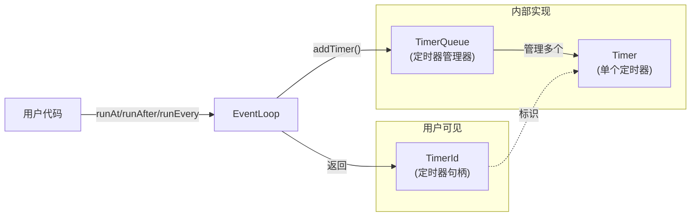
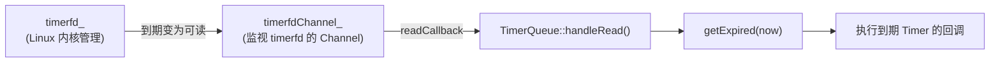
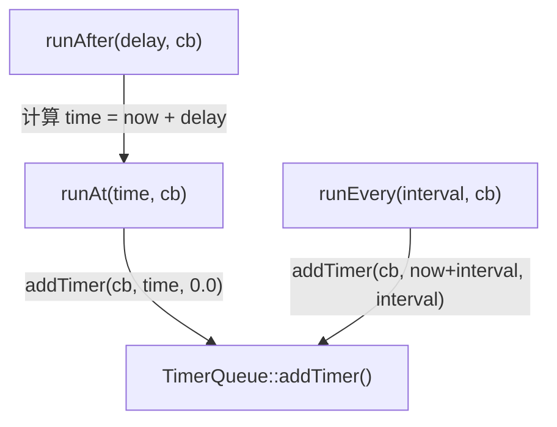
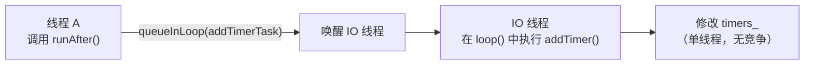
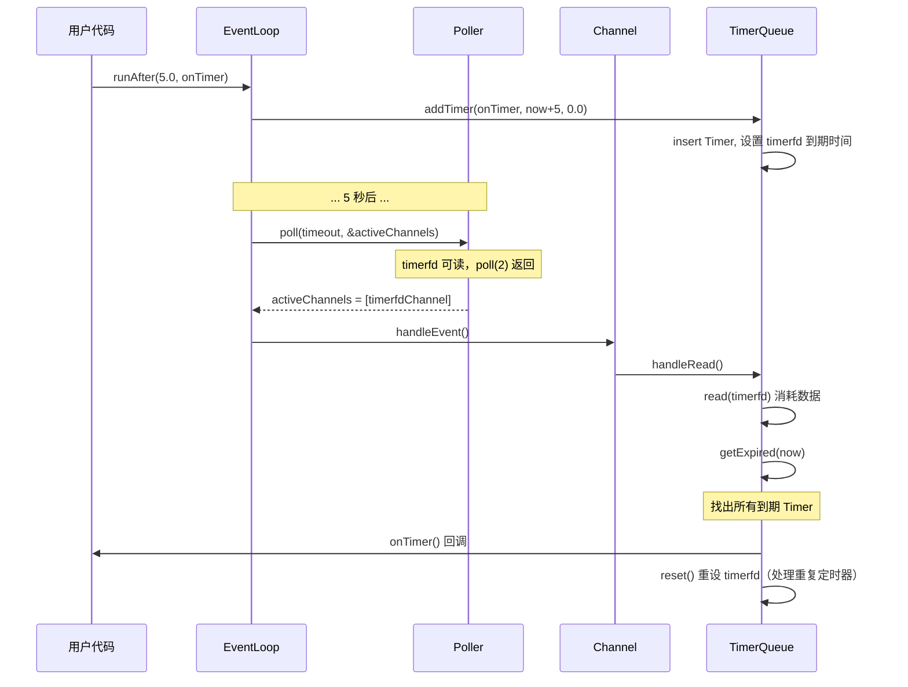

# Muduo TimerQueue 定时器理解说明

## 原话

> 有了前面的 Reactor 基础，我们可以给 EventLoop 加上定时器功能。传统的 Reactor 通过控制 `select(2)` 和 `poll(2)` 的等待时间来实现定时，而现在在 Linux 中有了 `timerfd`，我们可以用和处理 IO 事件相同的方式来处理定时，代码的一致性更好。
>
> muduo 的定时器功能由三个 class 实现，`TimerId`、`Timer`、`TimerQueue`，用户只能看到第一个 class，另外两个都是内部实现细节。

---

## 1. 为什么用 timerfd 实现定时器

### 传统方案

在传统的 Reactor 中，定时器是通过控制 `poll(2)` 的超时时间来实现的：

```cpp
// 传统方案：计算最近一个定时器的到期时间，作为 poll 的超时参数
int timeout = calculateNearestTimerTimeout();
int numEvents = ::poll(&pollfds[0], pollfds.size(), timeout);
// poll 返回后，先检查哪些定时器到期了，再处理 IO 事件
```

个人理解：定时器和之前fd的区别：fd是当监控的接口数据到来时，poll返回，执行回调函数；定时器是通过某种操作为poll设置超时时间，超时后，poll返回，执行回调函数。

这种方案的问题：

- **定时器处理逻辑**和 **IO 事件处理逻辑**是两套不同的代码路径。
- 超时精度受限于 `poll(2)` 的返回时机。
- 代码中需要在多个地方维护定时器超时计算。

### timerfd 方案（muduo 的选择）

Linux 提供了 `timerfd`——一个专门用于定时的文件描述符。**到时间了，timerfd 变为可读**，跟普通的 socket fd 一样能被 `poll(2)` 监视。

```cpp
// timerfd 方案：定时器和 IO 事件走完全相同的代码路径
int timerfd = timerfd_create(CLOCK_MONOTONIC, TFD_NONBLOCK | TFD_CLOEXEC);
// 设置 timerfd 的到期时间
timerfd_settime(timerfd, 0, &newValue, NULL);
// timerfd 到期 → fd 变为可读 → poll(2) 返回 → Channel::handleEvent() → 执行回调
```

### 对比

| 项目 | 传统方案 | timerfd 方案 |
|------|---------|-------------|
| 代码一致性 | IO 和定时器是两套逻辑 | 统一用 Channel + Poller |
| 实现复杂度 | 需要手动计算超时、管理定时器列表 | timerfd 交给 Poller 监视，到期自动触发 |
| 精度 | 受限于 poll 超时精度 | timerfd 由内核管理，精度高 |
| 可调试性 | strace 中看不到定时器细节 | strace 中能看到 timerfd 的读事件 |

**一句话**：timerfd 让定时器变成了"普通的 IO 事件"，Reactor 的所有机制（Channel、Poller、EventLoop）都可以直接复用。

---

## 2. 三个类的职责

muduo 的定时器功能由三个类组成：



| 类 | 对用户可见？ | 职责 |
|----|------------|------|
| **TimerId** | 是 | 定时器的"身份证"——用户拿到它可以将来取消定时器 |
| **Timer** | 否 | 一个具体的定时器实体，存储回调函数、到期时间、是否重复等 |
| **TimerQueue** | 否 | 管理所有 Timer 的容器，负责添加、删除、查找到期的定时器 |

### 为什么只暴露 TimerId

用户不需要知道 Timer 和 TimerQueue 的内部细节。他只需要：

1. 设定定时器（`runAt`、`runAfter`、`runEvery`）→ 拿到一个 `TimerId`。
2. 取消定时器（`cancel(timerId)`）→ 用 `TimerId` 标识要取消哪个。

这是**封装**的体现：对外接口越简单，使用越不容易出错。

---

## 3. 数据结构选型详解

TimerQueue 需要管理一组定时器，核心操作有：

- **找到所有到期的 Timer**（根据当前时间）
- **添加新 Timer**
- **删除某个 Timer**

原文讨论了四种方案：

### 方案一：有序线性表

```
timers: [Timer(1s), Timer(3s), Timer(5s), Timer(8s)]
         ^^^^^^^^
         最早到期的在前面
```

- 查找到期：从头扫描，O(K)，K 是到期数量。
- 添加：需要找到正确位置插入，O(N)。
- 删除：线性查找，O(N)。
- **评价**：简单，但在 Timer 较多时效率不够。muduo 最初用的就是这种结构。

### 方案二：二叉堆（优先队列）

```
        Timer(1s)
       /         \
   Timer(3s)   Timer(5s)
   /
Timer(8s)
```

- 查找到期：堆顶就是最早到期的，O(1) 查看 + O(log N) 弹出。
- 添加：O(log N)。
- 删除中间元素：**问题所在**——C++ 标准库的 `make_heap()`、`push_heap()`、`pop_heap()` 只能操作堆顶，无法高效删除堆中间的某个元素。要实现高效删除，需要让 Timer 记住自己在堆中的位置（index），并自己实现堆操作。
- **评价**：性能好，但实现复杂。`libev` 用的是更高效的 4-heap。

### 方案三：`map<Timestamp, Timer*>`

```cpp
std::map<Timestamp, Timer*> timers;
// key = 到期时间, value = Timer 指针
```

- 查找到期：`lower_bound(now)` 之前的所有元素都是到期的，O(log N)。
- 添加/删除：O(log N)。
- **致命问题**：如果两个 Timer 的到期时间完全相同，`map` 的 key 会冲突——同一个 key 只能对应一个 value。

### 方案四：`set<pair<Timestamp, Timer*>>`（muduo 的选择）

```cpp
typedef std::pair<Timestamp, Timer*> Entry;
typedef std::set<Entry> TimerList;
```

**关键思路**：用 `pair<Timestamp, Timer*>` 作为 key。即便两个 Timer 到期时间相同（`Timestamp` 一样），它们的内存地址（`Timer*`）也必定不同，所以 pair 整体不会重复。

```
timers_ (set):
  {1s, 0x1000}  ← Timer A
  {3s, 0x2000}  ← Timer B
  {3s, 0x3000}  ← Timer C（与 B 同时到期，但地址不同，所以可以共存）
  {5s, 0x4000}  ← Timer D
```

- 查找到期：`lower_bound` + 范围操作，O(log N + K)。
- 添加/删除：O(log N)。
- **为什么用 set 而不是 map**：因为 Entry 本身就包含了所有信息（时间 + 指针），没有额外的 value 需要存储。set 只有 key 没有 value，比 map 更合适。

### 方案对比表

| 方案 | 添加 | 删除 | 查找到期 | 是否处理同时刻 | 实现复杂度 |
|------|------|------|---------|-------------|----------|
| 有序线性表 | O(N) | O(N) | O(K) | 可以 | 极简 |
| 二叉堆 | O(log N) | O(log N) 需自定义 | O(1)+O(K log N) | 可以 | 较复杂 |
| `map<Timestamp, Timer*>` | O(log N) | O(log N) | O(log N + K) | **不行** | 简单 |
| **`set<pair<Timestamp, Timer*>>`** | **O(log N)** | **O(log N)** | **O(log N + K)** | **可以** | **简单** |

muduo 选择方案四：**性能 O(log N)，实现简单，利用现成的 `std::set`，容易验证正确性。**

---

## 4. TimerQueue 数据成员解读

```cpp
// TimerQueue.h（reactor/s02）
class TimerQueue : boost::noncopyable
{
public:
    TimerQueue(EventLoop* loop);
    ~TimerQueue();

    TimerId addTimer(const TimerCallback& cb,
                     Timestamp when,
                     double interval);

private:
    // FIXME: use unique_ptr<Timer> instead of raw pointers.
    typedef std::pair<Timestamp, Timer*> Entry;
    typedef std::set<Entry> TimerList;

    void handleRead();
    std::vector<Entry> getExpired(Timestamp now);
    void reset(const std::vector<Entry>& expired, Timestamp now);
    bool insert(Timer* timer);

    EventLoop* loop_;
    const int timerfd_;
    Channel timerfdChannel_;
    TimerList timers_;  // Timer list sorted by expiration
};
```

### 逐个解读

| 成员 | 类型 | 作用 |
|------|------|------|
| `loop_` | `EventLoop*` | 所属的 EventLoop，用于线程断言 |
| `timerfd_` | `const int` | 通过 `timerfd_create()` 创建的定时器 fd |
| `timerfdChannel_` | `Channel` | 监视 `timerfd_` 的可读事件，到期时触发 `handleRead()` |
| `timers_` | `set<pair<Timestamp, Timer*>>` | 按到期时间排序的定时器集合 |

### timerfd 与 Channel 的关系



TimerQueue 在构造函数中：

1. 调用 `timerfd_create()` 创建 `timerfd_`。
2. 用 `timerfdChannel_` 封装 `timerfd_`。
3. 注册 `handleRead()` 为 `timerfdChannel_` 的读回调。
4. 调用 `timerfdChannel_.enableReading()` 开始监视。

这样，定时器到期时 → `timerfd_` 可读 → `poll(2)` 返回 → `Channel::handleEvent()` → `TimerQueue::handleRead()` → 找出到期的 Timer → 执行用户回调。

### 为什么只用一个 timerfd

TimerQueue 管理着很多个 Timer，但只用 **一个 timerfd**。做法是：

- `timerfd_` 始终设置为 **最早到期的那个 Timer 的时间**。
- 当最早的 Timer 到期后，`handleRead()` 处理完所有到期 Timer，再把 `timerfd_` 重新设置为下一个最早的到期时间。

这样只需要一个 fd，而不是每个 Timer 一个 fd（那样 fd 资源会很快耗尽）。


---

## 5. `getExpired()` 函数与哨兵值

### 源码

```cpp
// TimerQueue.cc
std::vector<TimerQueue::Entry> TimerQueue::getExpired(Timestamp now)
{
    std::vector<Entry> expired;
    Entry sentry = std::make_pair(now, reinterpret_cast<Timer*>(UINTPTR_MAX));
    TimerList::iterator it = timers_.lower_bound(sentry);
    assert(it == timers_.end() || now < it->first);
    std::copy(timers_.begin(), it, back_inserter(expired));
    timers_.erase(timers_.begin(), it);

    return expired;
}
```

这个函数做的事情是：**从 `timers_` 中找出所有到期的 Timer，移除它们，并返回。**

### 逐步解读

#### 第一步：构造哨兵值

```cpp
Entry sentry = std::make_pair(now, reinterpret_cast<Timer*>(UINTPTR_MAX));
```

哨兵（sentry）是一个"假的 Entry"：

- 时间设为 `now`（当前时间）
- `Timer*` 设为 `UINTPTR_MAX`（指针的最大可能值）

回顾 `set<pair<Timestamp, Timer*>>` 的排序规则：

1. 先按 `Timestamp` 比较（时间越早越前）
2. 时间相同时，按 `Timer*` 地址比较（地址越小越前）

所以 `sentry = {now, UINTPTR_MAX}` 在 set 中的位置是：**所有到期时间 <= now 的 Entry 之后、所有到期时间 > now 的 Entry 之前。**

为什么？因为：

- 到期时间 < now 的 Entry 肯定排在 sentry 前面。
- 到期时间 == now 的 Entry，由于 `Timer*` 地址一定 < `UINTPTR_MAX`（没有对象能分配到最大地址），也排在 sentry 前面。
- 到期时间 > now 的 Entry 排在 sentry 后面。

#### 第二步：`lower_bound` 定位

```cpp
TimerList::iterator it = timers_.lower_bound(sentry);
```

`lower_bound(sentry)` 返回第一个 **不小于** sentry 的元素的迭代器。结合上面的分析，`it` 指向的是 **第一个未到期的 Timer**。

```
timers_:  {1s, A}  {3s, B}  {3s, C}  {5s, D}  {8s, E}
                                      ↑
                            假设 now=4s，则 it 指向这里
          |<--- 到期（要移除）--->|    |<--- 未到期（保留）--->|
```

#### 第三步：断言检查

```cpp
assert(it == timers_.end() || now < it->first);
```

为什么是 `<` 而不是 `<=`？

- `it` 指向的是第一个未到期的 Timer。
- "未到期"意味着它的到期时间 **严格大于** `now`。
- 如果 `it->first == now`，说明这个 Timer 刚好到期，应该被包含在 expired 中——但我们的哨兵设计已经确保了这种情况：到期时间等于 now 的 Timer 因为 `Timer*` < `UINTPTR_MAX`，会排在 sentry 之前，已经被算作到期了。

所以 `it` 指向的 Timer 时间一定 **严格大于** `now`，用 `<` 是正确的。

#### 第四步：拷贝 + 删除

```cpp
std::copy(timers_.begin(), it, back_inserter(expired));  // 把到期的复制到 expired
timers_.erase(timers_.begin(), it);                       // 从 set 中移除
```

#### 第五步：返回

```cpp
return expired;
```

返回到期 Timer 的列表。编译器会实施 **RVO（返回值优化）**，不会真的拷贝 vector，而是直接在调用方的内存中构造，不必担心性能。

### 一张图理解 getExpired

```
                          now = 4.0s
                             |
timers_ (set):               |
  {1.0s, TimerA}  ─┐         |
  {2.5s, TimerB}   ├→ 到期   |
  {3.0s, TimerC}   │         |
  {3.0s, TimerD}  ─┘         |
                   sentry ──→ {4.0s, UINTPTR_MAX}
  {5.0s, TimerE}  ─┐         |
  {8.0s, TimerF}   ├→ 未到期 |
                   ─┘         |

lower_bound(sentry) → 指向 {5.0s, TimerE}
expired = [{1.0s, A}, {2.5s, B}, {3.0s, C}, {3.0s, D}]
```

---

## 6. Timer 的生命期管理

### 当前的问题

源码中有一句注释：

```cpp
// FIXME: use unique_ptr<Timer> instead of raw pointers.
```

当前 TimerQueue 用 **裸指针** 管理 Timer 对象：

```cpp
Timer* timer = new Timer(cb, when, interval);  // 手动 new
// ... 使用 timer ...
delete timer;  // 手动 delete
```

裸指针的问题：

- 必须在正确的时机手动 `delete`，忘了就内存泄漏。
- 异常发生时可能跳过 `delete`，资源泄漏。
- 代码中多处需要关心"谁负责 delete"的问题。

### 改进方向

| 方案 | 适用性 |
|------|--------|
| `shared_ptr<Timer>` | 可以，但 Timer 的所有权是明确的（只属于 TimerQueue），用 shared_ptr "小题大做" |
| `unique_ptr<Timer>` | 最合适——独占所有权，自动管理生命期，零开销 |

C++11 中改用 `unique_ptr<Timer>` 后：

```cpp
std::unique_ptr<Timer> timer(new Timer(cb, when, interval));
// 不需要手动 delete，unique_ptr 析构时自动释放
```

muduo 正式版后来确实做了这个改进。

---

## 7. EventLoop 新增的定时器接口

### 源码

```cpp
// EventLoop.cc（reactor/s02）
TimerId EventLoop::runAt(const Timestamp& time, const TimerCallback& cb)
{
    return timerQueue_->addTimer(cb, time, 0.0);
}

TimerId EventLoop::runAfter(double delay, const TimerCallback& cb)
{
    Timestamp time(addTime(Timestamp::now(), delay));
    return runAt(time, cb);
}

TimerId EventLoop::runEvery(double interval, const TimerCallback& cb)
{
    Timestamp time(addTime(Timestamp::now(), interval));
    return timerQueue_->addTimer(cb, time, interval);
}
```

### 三个接口的区别

| 接口 | 含义 | 参数 | 是否重复 |
|------|------|------|---------|
| `runAt(time, cb)` | 在 **指定时刻** 执行 `cb` | 绝对时间 | 不重复（`interval = 0.0`） |
| `runAfter(delay, cb)` | **延迟** `delay` 秒后执行 `cb` | 相对时间（秒） | 不重复 |
| `runEvery(interval, cb)` | 每隔 `interval` 秒重复执行 `cb` | 间隔时间（秒） | 重复 |

### 调用关系



`runAfter` 只是 `runAt` 的便利封装——先把相对时间转为绝对时间，再调用 `runAt`。

`runEvery` 和 `runAt` 的区别在于第三个参数 `interval`：

- `interval = 0.0` → 单次定时器
- `interval > 0.0` → 重复定时器，到期后会自动重新设定下一次到期时间

### 使用示例

```cpp
// 3 秒后执行一次
loop.runAfter(3.0, []() { printf("3 seconds later\n"); });

// 在指定时刻执行
loop.runAt(someTimestamp, []() { printf("at that time\n"); });

// 每 2 秒执行一次
loop.runEvery(2.0, []() { printf("every 2 seconds\n"); });
```

---

## 8. 跨线程调用的安全性

### 问题

原文指出：

> 这几个 EventLoop 成员函数应该允许跨线程使用，比方说我想在某个 IO 线程中执行超时回调。

考虑这个场景：

```
线程 A（计算线程）                线程 B（IO 线程，EventLoop 所在）
     |                               |
     |  loop->runAfter(5, callback)  |
     |  ──────────────────────────→  |
     |                               |
     |  这会修改 TimerQueue 的内部   |
     |  数据结构 timers_（std::set） |
```

`TimerQueue::addTimer()` 会修改 `timers_`（一个 `std::set`），而 `timers_` 同时可能正被 IO 线程的 `getExpired()` 读取。两个线程同时操作同一个 `std::set`——**竞争条件！**

### muduo 的解决方案：不加锁，而是转移到 IO 线程

muduo 不使用互斥锁来保护 `timers_`，而是把 `addTimer()` 的实际操作 **转移** 到 IO 线程去执行：



这利用的是下一节（8.3）将介绍的 `EventLoop::runInLoop()` 机制：

- 如果调用者就在 IO 线程 → 直接执行。
- 如果调用者不在 IO 线程 → 把任务排队到 IO 线程的待执行列表中，并唤醒 IO 线程。

**好处**：`timers_` 始终只在 IO 线程被访问，不需要加锁，没有锁竞争，性能更好。

---

## 9. 时序图（图 8-2）

以下是 TimerQueue 回调用户代码 `onTimer()` 的完整时序：



### 关键步骤说明

1. **用户调用 `runAfter(5.0, onTimer)`**：EventLoop 转发给 TimerQueue。
2. **TimerQueue 插入 Timer 并设置 `timerfd_`**：让 `timerfd_` 在 5 秒后到期。
3. **5 秒后 `timerfd_` 变为可读**：`poll(2)` 返回。
4. **EventLoop 调用 `timerfdChannel_` 的 `handleEvent()`**：触发 `TimerQueue::handleRead()`。
5. **`handleRead()` 先 `read(timerfd_)` 消耗数据**：避免 Level Trigger 下反复触发。
6. **`getExpired(now)` 找出所有到期 Timer**：用哨兵值 + `lower_bound` 高效定位。
7. **依次调用到期 Timer 的回调函数**：用户的 `onTimer()` 在这里执行。
8. **`reset()` 处理重复定时器**：如果某个 Timer 有 `interval > 0`，重新插入 set 并更新 `timerfd_` 的下一次到期时间。

---

## 10. 常见疑问小结

### Q1：为什么不用 `multimap` 而用 `set<pair<...>>`？

原文指出："这样可以避免使用不常见的 `multimap` class"。`multimap` 的接口和行为（同一个 key 可以对应多个 value）在日常开发中不太常用，代码审查时其他人可能不熟悉。而 `set<pair<...>>` 用的是大家都熟悉的 `set`，只是 key 类型稍微复杂一点。

### Q2：`reinterpret_cast<Timer*>(UINTPTR_MAX)` 安全吗？

这个指针值只用于比较大小，永远不会被解引用（不会 `*` 或 `->`）。`UINTPTR_MAX` 是 `uintptr_t` 的最大值，转换成指针后保证比任何真实对象的地址都大。这是一种常见的"哨兵值"技巧，用于制造一个"比所有合法值都大的假值"。

### Q3：为什么不是每个 Timer 一个 timerfd？

因为文件描述符是有限的系统资源（默认每进程约 1024 个）。如果有上千个定时器，每个一个 timerfd 会耗尽 fd 资源。用一个 timerfd + set 的方案，只占用一个 fd，无论有多少定时器。

### Q4：`handleRead()` 中为什么要 `read(timerfd_)`？

因为 `poll(2)` 是 Level Trigger：只要 timerfd 中有未读的数据，`poll(2)` 就会反复报告它可读。`read()` 消耗掉数据后，timerfd 不再"可读"，下次 `poll(2)` 就不会再触发了。

### Q5：`getExpired()` 返回 vector 不会拷贝吗？

不会。编译器会实施 **RVO（Return Value Optimization，返回值优化）**——直接在调用方的栈帧上构造 vector，不产生拷贝。即使编译器不做 RVO，C++11 的移动语义也能保证只做一次 move 而不是拷贝。

### Q6：`addTimer()` 注释说 "Must be thread safe. Usually be called from other threads."，但上面说不加锁？

这看起来矛盾，但实际上 `addTimer()` 内部会通过 `runInLoop()` 机制保证安全：如果调用者不在 IO 线程，操作会被排队到 IO 线程执行。"thread safe" 的意思不是说"加了锁"，而是说"即使从其他线程调用也不会出问题"。

---

## 11. 快速参考

| 项目 | 说明 |
|------|------|
| **定时器实现方式** | timerfd（统一到 IO 事件，而非控制 poll 超时） |
| **三个类** | TimerId（用户句柄）、Timer（实体）、TimerQueue（管理器） |
| **数据结构** | `set<pair<Timestamp, Timer*>>`，O(log N)，避免同时刻冲突 |
| **只用一个 timerfd** | 始终设为最早到期时间，到期后重设 |
| **getExpired 哨兵** | `{now, UINTPTR_MAX}`，让 `lower_bound` 准确分割到期/未到期 |
| **生命期管理** | 当前裸指针（FIXME），应改用 `unique_ptr` |
| **用户接口** | `runAt(time, cb)`、`runAfter(delay, cb)`、`runEvery(interval, cb)` |
| **跨线程安全** | 不加锁，通过 `runInLoop()` 转移到 IO 线程执行 |
